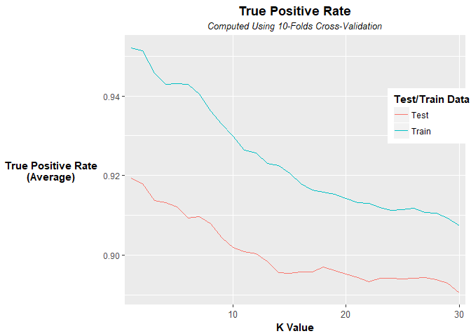
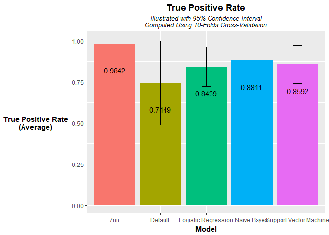
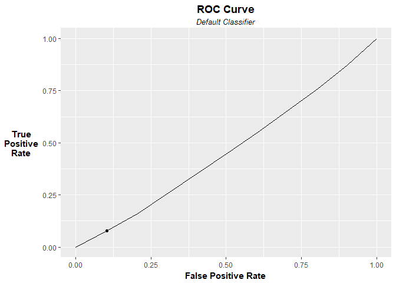

## Abstract


As a large financial institution with a digital platform supported by significant infrastructure, XYZ Bank is facing potentially costly threats from actors that seek to exploit vulnerabilities in its IT systems to siphon funds from user accounts.  This project seeks to identify important attributes correlated with network intrusions, develop a model that accurately predicts whether a network session is part of an intrusion attempt, and analyze the patterns of known intrusion events to identify common attack methods.

We evaluate the performance of KNN, Logistic Regression, Naive Bayes, Support Vector Machine and Rules-Based classifiers, as well as the default model. Evaluations are performed using 10-folds cross-validation and cost-aware selection of the optimal True Positive Rate/ False Positive Rate tradeoff that assumes a cost ratio between False Negative events and False Positive events of 9:2.  We also identify patterns of common intrusions using a hierarchical clustering method and propose possible methods of attack those patterns may relate to.

We conclude with suggestions for next steps in deploying and enhancing the XYZ Bank network intrusion detection model with consideration given to practical difficulties and opportunities to enhance the model accuracy and capabilities through the collection of new data.


## Introduction {.tabset .tabset-fade .tabset-pills}

### Loading the data and re-naming variables
I will assume for this part that the user has file saved in the working directory. This will load the data and rename the columns to something more useful.


```r
setwd("C:/Users/nicho/OneDrive/Documents/CMU/Data Mining/Project/Summary and Data")

# First we will grab the data from 'network_traffic.csv.' I'll assume the file is saved in the user's working directory.

net_traffic <- read.csv("C:/Users/nicho/OneDrive/Documents/CMU/Data Mining/Project/Summary and Data/network_traffic.csv", header=TRUE)
net_traffic <- net_traffic[complete.cases(net_traffic), ]
net_traffic <- droplevels(net_traffic)
net_traffic <- transform(net_traffic,
                         is_intrusion = mapvalues(is_intrusion, "0=", 0))
# The attributes represented in 'zeroattributes' only have values of '0' 
# so I'm removing them from 'net_traffic'
zeroattributes <- c(7:9, 11, 15, 20, 21)
net_traffic <- net_traffic[, -zeroattributes]
# Re-coding values based on the data descriptions provided
net_traffic <- transform(net_traffic, is_intrusion = mapvalues(is_intrusion, 
                                                               c(0, 1), 
                                                               c("Benign Session", "Intrusion")),
                                      logged_in = as.factor(mapvalues(logged_in,
                                                            c(0, 1),
                                                            c("No", "Yes"))),
                                      root_shell = as.factor(mapvalues(root_shell,
                                                            c(0, 1),
                                                            c("Not Obtained", "Obtained"))),
                                      is_guest_login = as.factor(mapvalues(is_guest_login,
                                                            c(0, 1),
                                                            c("No", "Yes"))))
```


### Load Helpful Functions


```r
brief <- function(y = NULL, x = NULL) {
  if(is.null(x)) {x <- read.csv(y)} 
  else{y = y}
  attribute_names <- names(x)
  # create an object for holding numeric attribute summary information
  numeric_attributes <- c()
  # create an object for holding symbolic attribute summary information
  symbolic_attributes <- c()
  for(i in 1:length(attribute_names)) {
    if(is.numeric(x[, i])) {
      numeric_attributes <- rbind(numeric_attributes, list(Attribute_ID = i,
                                                           Attribute_Name = attribute_names[i],
                                                           Missing = sum(is.na(x[, i]) | x[, i] == ""),
                                                           Mean = formatC(mean(x[, i], na.rm = TRUE), format = "f", digits = 2),
                                                           Median = formatC(median(x[, i], na.rm = TRUE), format = "f", digits = 2),
                                                           SDev = formatC(sd(x[, i], na.rm = TRUE), format = "f", digits = 2),
                                                           Min = formatC(min(x[, i], na.rm = TRUE), format = "f", digits = 2),
                                                           Max = formatC(max(x[, i], na.rm = TRUE), format = "f", digits = 2)))  
    } else {
      i_arity <- length(levels(x[, i]))
      # create an object for storing counts of factor levels
      MCVs_summary <- c()
      MCVs_freq_table <- rev(sort(table(x[, i])))
      # summaries of countable factor levels should include at most three levels,
      # sorted in descending order
      for (j in 1:min(3, i_arity)) {
        MCVs_summary <- paste(MCVs_summary, attributes(MCVs_freq_table)$dimnames[[1]][j], " (", MCVs_freq_table[[j]][1],") ", sep = "")
      }
      symbolic_attributes <- rbind(symbolic_attributes, list(Attribute_ID = i,
                                                             Attribute_Name = attribute_names[i],
                                                             Missing = sum(is.na(x[, i]) | x[, i] == ""),
                                                             Arity = i_arity,
                                                             MCVs_Count = MCVs_summary))
    }
  }
  # Format the output 
  top.text <- paste("Brief function output for", y, sep =" ")
  top.border <- paste(rep("~", nchar(top.text)), collapse = "")
  writeLines(paste(top.border, "\n", 
                   top.text, "\n", 
                   top.border, "\n", 
                   "This data set has ", length(x[, 1]), " rows ", length(attribute_names), " attributes\n",
                   "Real Valued Attributes\n",
                   paste(rep("-", nchar("Real Valued Attributes")), collapse = ""), "\n", sep = ""))
  print(as.data.frame(numeric_attributes))
  writeLines(paste("Symbolic Attributes\n", 
                   paste(rep("-", nchar("Symbolic Attributes")), collapse = ""), "\n", sep = ""))
  print(as.data.frame(symbolic_attributes))
}

#logistic regression
get_pred_logit<-function(train,test,train.review = FALSE){
  nf<-ncol(train) 
  colnames(train)[nf]<-'output' 
  colnames(test)[nf]<-'output'
  my.model_name<-glm(output~.,data=train,family=binomial)
  if(train.review == FALSE) {
    pred<-predict(my.model_name,test,type='response')
    true_output<-test$output
  } else {
    pred<-predict(my.model_name,train,type='response')
    true_output<-train$output 
  }
  pred.df<-data.frame(pred,true_output)
  return(pred.df)
}

get_pred_rules<-function(train,test,train.review = FALSE){
  nf<-ncol(train) 
  colnames(train)[nf]<-'output' 
  colnames(test)[nf]<-'output'
  my.model_name<-CBA(output ~.,
                     data = train, 
                     support = 0.1,
                     confidence = 0.1,
                     parameter = list(maxlen = 10))
  if(train.review == FALSE) {
    pred<-predict(my.model_name,test)
    true_output<-test$output
  } else {
    pred<-predict(my.model_name,train)
    true_output<-train$output 
  }
  pred.df<-data.frame(pred,true_output)
  return(pred.df)
}

#naieve bayes 
get_pred_nb<-function(train,test,train.review = FALSE){
  nf<-ncol(train) 
  colnames(train)[nf]<-'output' 
  colnames(test)[nf]<-'output'
  my.model_name<-naiveBayes(output~.,data=train)
  if(train.review == FALSE) {
    pred<-predict(my.model_name,test,type='raw')[,'1']
    true_output<-test$output 
  } else {
    pred<-predict(my.model_name,train,type='raw')[,'1']
    true_output<-train$output 
  }
  pred.df<-data.frame(pred,true_output)
  return(pred.df)  
}


#SVM using default linear kernal
get_pred_svm<-function(train,test,train.review = FALSE){
  nf<-ncol(train) 
  colnames(train)[nf]<-'output' 
  colnames(test)[nf]<-'output'
  my.model_name<-svm(as.factor(output)~.,data=train,probability=TRUE)
  if(train.review == FALSE) {
    pred<-attr(predict(my.model_name,test,probability = TRUE),'prob')[,'1']  
    true_output<-test$output 
  } else {
      pred<-attr(predict(my.model_name,train,probability = TRUE),'prob')[,'1']  
      true_output<-train$output 
  }
  pred.df<-data.frame(pred,true_output)
  return(pred.df)  
}

#KNN
get_pred_knn<-function(train,test,k,train.review = FALSE){
  nf<-ncol(train) 
  colnames(train)[nf]<-'output' 
  colnames(test)[nf]<-'output'
  train.data<-train[,-nf] 
  test.data<-test[,-nf] 
  class<-as.factor(train[,nf])
  if(train.review == FALSE) {
    my.model_name<-knn(train = train.data, test = test.data,class,k=k,prob=TRUE)
    prob<-attr(my.model_name,"prob") 
    pred<-ifelse(my.model_name=='1',prob,1-prob)  
    true_output<-test$output 
  } else {
    my.model_name<-knn(train = train.data,test = train.data,class,k=k,prob=TRUE)
    prob<-attr(my.model_name,"prob") 
    pred<-ifelse(my.model_name=='1',prob,1-prob)  
    true_output<-train$output
  }
  pred.df<-data.frame(pred,true_output)
  return(pred.df)  
}

# Default predictor model
# Assumes the last column of data is the output dimension
get_pred_default <- function(train,test, train.review = FALSE){
  nf <- ncol(train)
  if(train.review == FALSE) {
    pred <- rep(mean(train[, nf], na.rm = TRUE), nrow(test))
    true_output <- test[, nf]
  } else {
    pred <- rep(mean(train[, nf], na.rm = TRUE),nrow(train))
    true_output <- train[, nf]
  }
  pred.df <- data.frame(pred,true_output)
  return(pred.df)
}

get_folds <- function(nn, k) {
  index <- seq(1, nn)
  rand.index <- sample(index, nn)
  group <- seq_along(rand.index)%%k
  chunk <- split(rand.index, group)
  return(chunk)
}

#PART 2
#your implementation of do_cv_class goes here
do_cv_class <- function(df, output = NULL, k, model_name, review.training.data = FALSE, cutoff = 0.5, folds = NULL) {
  #  if a string was entered for model_name representing knn, parse the entry to
  #  determine the value of k (store as n because we're already using k)
  if(grepl("nn", model_name, ignore.case = TRUE)) {
      end.n <- regexpr("nn", model_name, ignore.case = TRUE) - 1
      n <- as.numeric(substr(model_name, 1, end.n))
      model_name <- "get_pred_knn"
  } else {
    model_name <- mapvalues(model_name, 
                            c("logreg", "svm", "nb", "default", "rules"),
                            c("get_pred_logit","get_pred_svm","get_pred_nb", "get_pred_default", "get_pred_rules"))
  }

  nf <-  ncol(df)
  # if the user inputs an output attribute, sort the columns of df so that 'output'
  # is in the last column.
  if(!is.null(output)) {
    column.index <- seq(1, nf)
    output.index <- which(names(df) == output)
    new.index <- c(column.index[-output.index], output.index)
    df <- df[, new.index]
  }
  
  nn <-  length(df[, 1])
  if(is.null(folds)){
    folds <- get_folds(nn, k)
  }
  score <- data.frame(pred          = c(NULL),
                      true_output   = c(NULL),
                      folds         = c(NULL))
  
  for (ii in 1:length(folds)) {
    test.index <- folds[[ii]]
    train.data <- df[-test.index, ]
    test.data <- df[test.index, ]
    if(review.training.data == FALSE) {
      if(model_name == "get_pred_knn"){
        pred <- get_pred_knn(train.data, test.data, n, train.review = FALSE)
      } else {
        pred <- do.call(model_name, list(train.data, test.data))
      }
    } else {
      if(model_name == "get_pred_knn"){
      pred <- get_pred_knn(train.data, test.data, n, train.review = TRUE)
    } else {
      pred <- do.call(model_name, list(train.data, test.data, train.review = TRUE))
    }
    }
    fold.number <- names(folds)[[ii]]
    pred <- cbind(pred, folds = rep(fold.number, length(pred[,1])))
    score <- rbind(score, pred)
  }
  return(score)
}


#PART 3

#input prediction file the first column of which is prediction value
#the 2nd column is true label (0/1)
#cutoff is a numeric value, default is 0.5
get_metrics<-function(pred,cutoff=0.5){
  ### assumes that 1 is "positive" outcome
  pred.bi <- ifelse(pred[,1] > cutoff, 1, 0)
  pred.bi.df<-data.frame(true=pred[,2],pred=pred.bi)
  tbl<-table(pred.bi.df)
  n11=ifelse(inherits(tryCatch(tbl['1','1'], error=function(e) e), "error"),0,tbl['1','1']) 
  n10=ifelse(inherits(tryCatch(tbl['1','0'], error=function(e) e), "error"),0,tbl['1','0'])
  n01=ifelse(inherits(tryCatch(tbl['0','1'], error=function(e) e), "error"),0,tbl['0','1'])
  n00=ifelse(inherits(tryCatch(tbl['0','0'], error=function(e) e), "error"),0,tbl['0','0'])
  
  Pos<-n11+n10
  Neg<-n01+n00
  PPos<-n11+n01
  PNeg<-n10+n00
  total <- sum(tbl)
  
  conf_matrix <- data.frame(tpr = n11/Pos, 
                            fpr = n01/Neg, 
                            acc = (n11 + n00)/total, 
                            precision = n11/(n11 + n01), 
                            recall = n11/Pos)
  return(conf_matrix)
}

get_rules_metrics <-function(df) {
  conf_matrix <- data.frame(tpr = c(NULL), 
                            fpr = c(NULL), 
                            acc = c(NULL), 
                            precision = c(NULL), 
                            recall = c(NULL))
for(i in 0:(length(unique(df$folds))-1)) {
  df %>%
    filter(folds == i) ->pred.bi.table
 pred.bi.table <- droplevels(pred.bi.table)
 pred.bi.table <- pred.bi.table[, 1:2]
    table(pred.bi.table) ->tbl
  n11=ifelse(inherits(tryCatch(tbl['1','1'], error=function(e) e), "error"),0,tbl['1','1']) 
  n10=ifelse(inherits(tryCatch(tbl['1','0'], error=function(e) e), "error"),0,tbl['1','0'])
  n01=ifelse(inherits(tryCatch(tbl['0','1'], error=function(e) e), "error"),0,tbl['0','1'])
  n00=ifelse(inherits(tryCatch(tbl['0','0'], error=function(e) e), "error"),0,tbl['0','0'])
  
  Pos<-n11+n10
  Neg<-n01+n00
  PPos<-n11+n01
  PNeg<-n10+n00
  total <- sum(tbl)
  
  conf_matrix <- rbind( conf_matrix,
                        list(tpr = n11/Pos, 
                            fpr = n01/Neg, 
                            acc = (n11 + n00)/total, 
                            precision = n11/(n11 + n01), 
                            recall = n11/Pos))
  
}
  return(conf_matrix)
}

get_generalization_summary <-function(df, output, num.folds, k.range, t.score){
  # data frame for storing the 10-folds cross validation results for each value of k for the knn model
  k.metrics <- c()
  k.metrics.summary <- data.frame(k.value   = c(NULL),
                                  mean.tpr  = c(NULL),
                                  low.tpr   = c(NULL),
                                  high.tpr  = c(NULL),
                                  mean.fpr  = c(NULL),
                                  low.fpr   = c(NULL),
                                  high.fpr  = c(NULL),
                                  mean.acc  = c(NULL),
                                  low.acc   = c(NULL),
                                  high.acc  = c(NULL),
                                  mean.prec = c(NULL),
                                  low.prec  = c(NULL),
                                  high.prec = c(NULL),
                                  mean.rec  = c(NULL),
                                  low.rec   = c(NULL),
                                  high.rec  = c(NULL),
                                  train.review = c(NULL))
  for(i in 1:k.range) {
  model.name <- paste(i,'nn', sep="")
  tmp<-do_cv_class(df, output, num.folds, model.name)
  tmp2<-do_cv_class(df, output, num.folds, model.name, review.training.data = TRUE)
  folds.index <- unique(tmp$folds)
  for(j in 1:length(folds.index)) {
    this.fold.train.metrics <- tmp %>% subset(folds == folds.index[j]) %>% get_metrics()
    this.fold.test.metrics <- tmp2 %>% subset(folds == folds.index[j]) %>% get_metrics()
    this.fold.train.metrics$train.review <- FALSE
    this.fold.test.metrics$train.review <- TRUE
    k.metrics <- rbind(k.metrics, this.fold.train.metrics, this.fold.test.metrics)
  }
  for(t in TRUE:FALSE) {
  k.metrics.subset <- subset(k.metrics, train.review == t)  
  k.metrics.summary <- rbind(k.metrics.summary,
                             list(k.value   = i,
                                  mean.tpr  = mean(k.metrics.subset$tpr),
                                  low.tpr   = mean(k.metrics.subset$tpr) - (sd(k.metrics.subset$tpr)/sqrt(num.folds)*t.score),
                                  high.tpr  = mean(k.metrics.subset$tpr) + (sd(k.metrics.subset$tpr)/sqrt(num.folds)*t.score),
                                  mean.fpr  = mean(k.metrics.subset$fpr),
                                  low.fpr   = mean(k.metrics.subset$fpr) - (sd(k.metrics.subset$fpr)/sqrt(num.folds)*t.score),
                                  high.fpr  = mean(k.metrics.subset$fpr) + (sd(k.metrics.subset$fpr)/sqrt(num.folds)*t.score),
                                  mean.acc  = mean(k.metrics.subset$acc),
                                  low.acc   = mean(k.metrics.subset$acc) - (sd(k.metrics.subset$acc)/sqrt(num.folds)*t.score),
                                  high.acc  = mean(k.metrics.subset$acc) + (sd(k.metrics.subset$acc)/sqrt(num.folds)*t.score),
                                  mean.prec  = mean(k.metrics.subset$precision),
                                  low.prec   = mean(k.metrics.subset$precision) - (sd(k.metrics.subset$precision)/sqrt(num.folds)*t.score),
                                  high.prec  = mean(k.metrics.subset$precision) + (sd(k.metrics.subset$precision)/sqrt(num.folds)*t.score),
                                  mean.rec  = mean(k.metrics.subset$recall),
                                  low.rec   = mean(k.metrics.subset$recall) - (sd(k.metrics.subset$recall)/sqrt(num.folds)*t.score),
                                  high.rec  = mean(k.metrics.subset$recall) + (sd(k.metrics.subset$recall)/sqrt(num.folds)*t.score),
                                  train.review = t))
  
  }
  }
  k.metrics.summary$k.value <- factor(as.factor(k.metrics.summary$k.value))
  k.metrics.summary$train.review <- factor(as.factor(k.metrics.summary$train.review))
  return(k.metrics.summary)
}


# Takes pred.data as the output from do_cv_class, and returns values for 
# TPR and FPR at each unique cutoff point.  Also returns AUC.
get_roc<-function(pred.data){
  label<-pred.data[,2]
  if (length(unique(label))>=2){
    pred<-prediction(as.numeric(pred.data[,1]),as.numeric(pred.data[,2]))
    perf=performance(pred,"tpr","fpr")
    roc.x=perf@x.values[[1]]
    roc.y=perf@y.values[[1]]
    this.roc=data.frame(fpr=roc.x,tpr=roc.y)
    auc=performance(pred,"auc")@y.values[[1]]
    return(list(auc=auc,roc=this.roc))
  }
  else{
    return(list(auc=-1,roc=NULL))
  }
}
# Cycles through the TPR/FPR pairs, starting with the highest value of TPR !=1.
# For each step throug hthe ROC data, evaluates if the tradeoff between 
# performance at the 'optimal' cutoff and the current observed cutoff leads to
# improved model cost based on the tradeoff input.

optimize_roc <- function(roc.data, tradeoff) {
    
  if(sum(names(df) == "TPR" | names(df) == "FPR") == 2){
    names(roc.data)[1:2] <- c("tpr", "fpr")
    df <- roc.data
    print(names(df))
    } else {
    df <- roc.data$roc
  }
    i <- length(df$tpr)
  winner <- NULL
  for(j in (i - 1):3) {
    if(is.null(winner)) {
      if((df$tpr[j] == df$tpr[j-1]) & (df$fpr[j] > df$fpr[j - 1])) {
        winner <- j -1
      } else if((df$fpr[j] == df$fpr[j-1]) & (df$tpr[j] < df$tpr[j - 1])) {
        winner <- j - 1
      } else if((df$fpr[j] == df$fpr[j-1]) & (df$tpr[j] == df$tpr[j - 1])) {
        winner <- j - 1
      } else if((df$tpr[j] - df$tpr[j-1])/(df$fpr[j] - df$fpr[j-1]) < tradeoff) {
        winner <- j - 1
      }
    } else {
      if((df$tpr[winner] == df$tpr[j-1]) & (df$fpr[winner] > df$fpr[j - 1])) {
        winner <- j -1
      } else if((df$fpr[winner] == df$fpr[j-1]) & (df$tpr[winner] < df$tpr[j - 1])) {
        winner <- j - 1
      } else if((df$fpr[winner] == df$fpr[winner-1]) & (df$tpr[winner] == df$tpr[winner - 1])) {
        winner <- j - 1
      } else if((df$tpr[winner] - df$tpr[j-1])/(df$fpr[winner] - df$fpr[j-1]) < tradeoff) {
        winner <- j - 1
      }
    }
  }
  if(!is.null(winner)) {
    # Return the results for the "winning" attribute that meets the conditions
    # associated with improving model performance following its removal
    return(c(df[winner, ], winner))
  } else {
    # Absent a "winning" attribute that meets the conditions for improving model
    # performance by removal, return the row with the highest TPR.
    return(c(df[i - 1, ], i -1))
  }
}

backwards_selection <- function(df, output = NULL, num.folds, model.name, tpr.fpr.tradeoff) {
  train.test <- get_folds(length(df[, 1]), num.folds)
  backstep.results <- data.frame(TPR = NULL,
                                 FPR = NULL,
                                 AUC = NULL,
                                 Removed = NULL,
                                 stringsAsFactors = FALSE)
  backstep.results$Removed <- as.character(backstep.results$Removed) 
  best.yet <- NULL
  if(!is.null(output)) {
    column.index <- seq(1, ncol(df))
    output.index <- which(names(df) == output)
    new.index <- c(column.index[-output.index], output.index)
    df <- df[, new.index]
  }
  # 1.  Generate predictions using CV.  
    pred <- do_cv_class(df, k = num.folds, model_name = model.name, folds = train.test)
  # 2.  Find optimal cutoff, using some tradeoff limit between TPR/FPR.  Set the baseline for TPR/FPR.
    roc <- get_roc(pred)
    baseline <- optimize_roc(roc, tpr.fpr.tradeoff)
    backstep.results <- rbind(backstep.results,
                              data.frame(TPR = baseline$tpr, 
                                         FPR = baseline$fpr,
                                         AUC = roc$auc,
                                         Removed = "None"))
    
  # 3.  Cycle through the input features, removing each, one by one.  As each feature is removed, subject it to the process in step 2.  
    for (i in 1:(ncol(df) - 1)) {
      pred <- tryCatch(do_cv_class(df[, -i], k = num.folds, model_name = model.name, folds = train.test),
                       warning = function(w) {print(paste("Problem feature: ",names(df)[i]))},
                       error = function(e) {print(paste("Problem feature: ",names(df)[i]))},
                       finally = pred)
      roc <- get_roc(pred)
       z <- length(backstep.results$TPR)
      new.df.optimized <- optimize_roc(roc, tpr.fpr.tradeoff)
        if((baseline$tpr <= new.df.optimized$tpr) & 
           (baseline$fpr >= new.df.optimized$fpr)) {
          best.yet <- new.df.optimized
          backstep.results <- rbind(backstep.results,
                                    data.frame(TPR = best.yet$tpr, 
                                               FPR = best.yet$fpr,
                                               AUC = roc$auc,
                                               Removed = names(df)[i]))
        } else if(baseline$tpr > new.df.optimized$tpr) {
            if(((baseline$tpr - new.df.optimized$tpr)/(baseline$fpr - new.df.optimized$fpr) < tpr.fpr.tradeoff) & 
               ((baseline$tpr - new.df.optimized$tpr)/(baseline$fpr - new.df.optimized$fpr) > 0)) {
                    best.yet <- new.df.optimized
backstep.results <- rbind(backstep.results,
                          data.frame(TPR = best.yet$tpr, 
                                     FPR = best.yet$fpr,
                                     AUC = roc$auc,
                                     Removed = names(df)[i]))
                }
        } else if(baseline$tpr < new.df.optimized$tpr) { 
                  if((baseline$tpr - new.df.optimized$tpr)/(baseline$fpr - new.df.optimized$fpr) > tpr.fpr.tradeoff) {
                    best.yet <- new.df.optimized
backstep.results <- rbind(backstep.results,
                          data.frame(TPR = best.yet$tpr, 
                                     FPR = best.yet$fpr,
                                     AUC = roc$auc,
                                     Removed = names(df)[i]))
                    }
        }
    
    }
    backstep.results %>%
      arrange(-AUC,-TPR, FPR) %>%
      return()
}

filter.features.by.cor <- function(df, output = NULL, top = NULL) {
  cor.df <- NULL
  if(!is.null(output)) {
    column.index <- seq(1, ncol(df))
    output.index <- which(names(df) == output)
    new.index <- c(column.index[-output.index], output.index)
    df <- df[, new.index]
  }
  for(i in 1:(ncol(df) - 1)) {
    x <- cor(df[, i], df[, ncol(df)])
    cor.df <- data.frame(rbind(cor.df, list(Correlation_Coefficient = x,
                                            Attribute = names(df)[i])))
  }
  cor.df$Correlation_Coefficient <- as.numeric(cor.df$Correlation_Coefficient)
  cor.df$Attribute <- as.vector(unlist(cor.df$Attribute))
  cor.df <- cor.df %>%
    arrange(-Correlation_Coefficient, Attribute) %>%
    mutate(Attribute = factor(Attribute, unique(Attribute)))
    if(!is.null(top)) {
      cor.df$rank <- if_else(rank(cor.df$Attribute) <= top, TRUE, FALSE)
    }
    return(cor.df)
}

multiplot <- function(..., plotlist=NULL, file, cols=1, layout=NULL) {
  library(grid)

  # Make a list from the ... arguments and plotlist
  plots <- c(list(...), plotlist)

  numPlots = length(plots)

  # If layout is NULL, then use 'cols' to determine layout
  if (is.null(layout)) {
    # Make the panel
    # ncol: Number of columns of plots
    # nrow: Number of rows needed, calculated from # of cols
    layout <- matrix(seq(1, cols * ceiling(numPlots/cols)),
                    ncol = cols, nrow = ceiling(numPlots/cols))
  }

 if (numPlots==1) {
    print(plots[[1]])

  } else {
    # Set up the page
    grid.newpage()
    pushViewport(viewport(layout = grid.layout(nrow(layout), ncol(layout))))

    # Make each plot, in the correct location
    for (i in 1:numPlots) {
      # Get the i,j matrix positions of the regions that contain this subplot
      matchidx <- as.data.frame(which(layout == i, arr.ind = TRUE))

      print(plots[[i]], vp = viewport(layout.pos.row = matchidx$row,
                                      layout.pos.col = matchidx$col))
    }
  }
}
```


### Data Summary

```r
options(width = 100)
brief(y = "net_traffic.csv", x = net_traffic)
```

```
## ~~~~~~~~~~~~~~~~~~~~~~~~~~~~~~~~~~~~~~~~~
## Brief function output for net_traffic.csv
## ~~~~~~~~~~~~~~~~~~~~~~~~~~~~~~~~~~~~~~~~~
## This data set has 3000 rows 16 attributes
## Real Valued Attributes
## ----------------------
## 
##   Attribute_ID     Attribute_Name Missing    Mean Median     SDev  Min       Max
## 1            1           duration       0  118.08   0.00   964.54 0.00  24204.00
## 2            5          src_bytes       0 4567.78 228.00 29461.82 0.00 283618.00
## 3            6          dst_bytes       0 2705.40 388.50  9988.33 0.00 273544.00
## 4            7                hot       0    0.07   0.00     0.80 0.00     25.00
## 5            9    num_compromised       0    0.30   0.00    16.14 0.00    884.00
## 6           11           num_root       0    0.35   0.00    17.80 0.00    975.00
## 7           12 num_file_creations       0    0.00   0.00     0.03 0.00      1.00
## 8           13         num_shells       0    0.00   0.00     0.02 0.00      1.00
## 9           14   num_access_files       0    0.00   0.00     0.11 0.00      5.00
## Symbolic Attributes
## -------------------
## 
##   Attribute_ID Attribute_Name Missing Arity                             MCVs_Count
## 1            2  protocol_type       0     3        tcp (2450) udp (510) icmp (40) 
## 2            3        service       0    16  http (1912) smtp (290) private (247) 
## 3            4           flag       0     6         SF (2745) REJ (154) RSTR (65) 
## 4            8      logged_in       0     2                   Yes (2153) No (847) 
## 5           10     root_shell       0     2      Not Obtained (2997) Obtained (3) 
## 6           15 is_guest_login       0     2                    No (2955) Yes (45) 
## 7           16   is_intrusion       0     2 Benign Session (2700) Intrusion (300)
```


It's worth noting that we are working with only 3,000 observations but a large regional financial institution like XYZ Bank is likely seeing many more network sessions on a monthly, if not weekly or daily, basis.  Also, 10% of our observations are Intrusions.  We accept these Intrusion events as "ground truth" given that these sessions were investigated by an XYZ Bank network analyst.


### Graphical Overview


```r
# Produces bar plot for symbolic variables
# X-axis labels adjusted for readability
net_traffic %>%
  ggplot(aes(x = protocol_type)) +
  geom_bar() +
  facet_wrap(~ is_intrusion)  +
  theme(axis.text.x = element_text(hjust = 1, size = 8),
        axis.text.y = element_text(angle = 0, size = 8),
        axis.title.x = element_text(hjust = 0.5, size = 10, face = "bold"),
        axis.title.y = element_text(vjust = 0.5, size = 10, face = "bold"),
        plot.title = element_text(hjust = 0.5, face = "bold", size = 10)) -> hist.protocol

net_traffic %>%
  ggplot(aes(x = service)) +
  geom_bar() +
  facet_wrap(~ is_intrusion)  +
  theme(axis.text.x = element_text(angle = 45, hjust = 1, size = 8),
        axis.text.y = element_text(angle = 0, size = 8),
        axis.title.x = element_text(hjust = 0.5, size = 10, face = "bold"),
        axis.title.y = element_text(vjust = 0.5, size = 10, face = "bold"),
        plot.title = element_text(hjust = 0.5, face = "bold", size = 10)) -> hist.service

net_traffic %>%
  ggplot(aes(x = flag)) +
  geom_bar() +
  facet_wrap(~ is_intrusion)  +
  theme(axis.text.x = element_text(hjust = 1, size = 8),
        axis.text.y = element_text(angle = 0, size = 8),
        axis.title.x = element_text(hjust = 0.5, size = 10, face = "bold"),
        axis.title.y = element_text(vjust = 0.5, size = 10, face = "bold"),
        plot.title = element_text(hjust = 0.5, face = "bold", size = 10))-> hist.flag

multiplot(hist.protocol,
          hist.service,
          hist.flag,
          cols=2)
```

<!-- -->

**Review of Protocol, Service and Flag Distributions**

We can identify distinct patterns in the protocols and services used for Benign Sessions and network Intrusions. FTP, FTP-data and Private services are disproportionately used for Intrusions, and Intrusions are much more frequently flagged as RSTR and S0 than Benign Sessions.


```r
net_traffic %>%
  ggplot(aes(x = duration)) +
  geom_histogram(bins = 11, binwidth = 100) +
  xlim(-100, 1000) +
  ylim(0, 3000) +
  facet_wrap(~ is_intrusion)  +
  theme(axis.text.x = element_text(angle = 45, hjust = 1, size = 8),
        axis.text.y = element_text(angle = 0, size = 8),
        axis.title.x = element_text(hjust = 0.5, size = 10, face = "bold"),
        axis.title.y = element_text(vjust = 0.5, size = 10, face = "bold"),
        plot.title = element_text(hjust = 0.5, face = "bold", size = 10)) -> hist.duration

net_traffic %>%
  ggplot(aes(x = src_bytes)) +
  geom_histogram(bins = 100) +
  xlim(0, 10000) +
  facet_wrap(~ is_intrusion)  +
  theme(axis.text.x = element_text(angle = 45, hjust = 1, size = 8),
        axis.text.y = element_text(angle = 0, size = 8),
        axis.title.x = element_text(hjust = 0.5, size = 10, face = "bold"),
        axis.title.y = element_text(vjust = 0.5, size = 10, face = "bold"),
        plot.title = element_text(hjust = 0.5, face = "bold", size = 10))-> hist.srcbytes

net_traffic %>%
  ggplot(aes(x = dst_bytes)) +
  geom_histogram(bins = 100) +
  xlim(0, 10000) +
  facet_wrap(~ is_intrusion)  +
  theme(axis.text.x = element_text(angle = 45, hjust = 1, size = 8),
        axis.text.y = element_text(angle = 0, size = 8),
        axis.title.x = element_text(hjust = 0.5, size = 10, face = "bold"),
        axis.title.y = element_text(vjust = 0.5, size = 10, face = "bold"),
        plot.title = element_text(hjust = 0.5, face = "bold", size = 10))-> hist.dstbytes

multiplot(hist.duration,
          hist.srcbytes,
          hist.dstbytes,
          cols=2)
```

<!-- -->


**Review of Duration, Source Bytes and Destination Bytes Distributions**

There are also distinct patterns in the measures of Duration, Source Bytes and Destination Bytes for Benign Sessions and network Intrusions. Intrusion sessions are more likely to have a long duration, and compared to Benign Sessions, the distribution of Destination Bytes for Intrusions is much more highly concentrated among two groupings on the left-hand side.


```r
net_traffic <- read.csv("C:/Users/nicho/OneDrive/Documents/CMU/Data Mining/Project/Summary and Data/network_traffic.csv", header=TRUE)
net_traffic <- net_traffic[complete.cases(net_traffic), ]
net_traffic <- droplevels(net_traffic)
net_traffic <- transform(net_traffic,
                         is_intrusion = mapvalues(is_intrusion, "0=", 0))
# The attributes represented in 'zeroattributes' only have values of '0' 
# so I'm removing them from 'net_traffic'
zeroattributes <- c(7:9, 11, 15, 20, 21)
net_traffic <- net_traffic[, -zeroattributes]

protocol.columns <- as.data.frame(model.matrix( ~ net_traffic$protocol_type - 1))
service.columns <- as.data.frame(model.matrix( ~ net_traffic$service - 1))
flag.columns <- as.data.frame(model.matrix( ~ net_traffic$flag - 1))

net_traffic_transformed <- cbind(net_traffic[, -c(2:4)], 
                                 protocol.columns, 
                                 service.columns,
                                 flag.columns)
p.names <- levels(net_traffic$protocol_type)
p.names <- paste("protocol_", p.names, sep ="")
s.names <- levels(net_traffic$service)
s.names <- paste("service_", s.names, sep ="")
f.names <- levels(net_traffic$flag)
f.names <- paste("flag_", f.names, sep ="")
new.names <- c(p.names, s.names, f.names)
names(net_traffic_transformed)[14:38] <- new.names
net_traffic_transformed$is_intrusion <- as.numeric(net_traffic_transformed$is_intrusion)
net_traffic <- transform(net_traffic,
                         is_intrusion = mapvalues(is_intrusion, c("1", "2"), c(0, 1)))


net.cor.rank <- filter.features.by.cor(net_traffic_transformed)
net.cor.rank %>%
  ggplot(aes(x = Attribute, y = Correlation_Coefficient)) +
  geom_bar(stat = "identity") +
  ggtitle("Correlation Coefficients\nAll Attributes Against Intrusion Indicator") +
  ylab("Correlation\nCoefficient") +
  theme(plot.title = element_text(hjust =0.5, face = "bold"),
        plot.subtitle = element_text(hjust =0.5, face = "italic"),
        legend.position = "none",
        axis.text.x = element_text(angle = 30, hjust = 1, vjust =1),
        axis.title.y = element_text(angle = 0, vjust =0.5, face = "bold"),
        axis.title.x = element_text(angle = 0, hjust =0.5, face = "bold"))
```

<!-- -->


**Interpretation of 1-to-1 Correlation for Intrusion Indicator**

In this measurement, the Intrusion indicator is a binary representation with 1 representing an Intrusion and 0 representing a Benign Session.  Some of the highly-positive correlated features make sense given the distributions viewed above:  Service(Private) and Service(FTP) were frequently used to propagate Intrusions in this network session data. 

Our hypothesis is that combinations of these attributes will identify patterns that an attacker uses to gain access to XYZ Bank's system in an attempt to access sensitive data, siphon funds and disrupt IT services. We will proceed to develop models that take into account these important features to identify Intrusions.


## Method and Result {.tabset .tabset-fade .tabset-pills}


### Model Evaluation


```r
## I want to clear the formatting that I applied previously w.r.t. re-labeling binary choices with symbolic respresentations (for the purpose of some of these models, the binary respresentation is better).
net_traffic <- read.csv("C:/Users/nicho/OneDrive/Documents/CMU/Data Mining/Project/Summary and Data/network_traffic.csv", header=TRUE)
net_traffic <- net_traffic[complete.cases(net_traffic), ]
net_traffic[which(net_traffic$is_intrusion == "0="), "is_intrusion"] <- 0
net_traffic <- droplevels(net_traffic)
net_traffic$is_intrusion <- as.numeric(net_traffic$is_intrusion)
net_traffic <- transform(net_traffic,
                         is_intrusion = mapvalues(is_intrusion, c("1", "2"), c(0, 1)))
# The attributes represented in 'zeroattributes' only have values of '0' 
# so I'm removing them from 'net_traffic'
zeroattributes <- c(7:9, 11, 15, 20, 21)
net_traffic <- net_traffic[, -zeroattributes]

protocol.columns <- as.data.frame(model.matrix( ~ net_traffic$protocol_type - 1))
service.columns <- as.data.frame(model.matrix( ~ net_traffic$service - 1))
flag.columns <- as.data.frame(model.matrix( ~ net_traffic$flag - 1))

net_traffic_transformed <- cbind(net_traffic[, -c(2:4)], 
                                 protocol.columns, 
                                 service.columns,
                                 flag.columns)
p.names <- levels(net_traffic$protocol_type)
p.names <- paste("protocol_", p.names, sep ="")
s.names <- levels(net_traffic$service)
s.names <- paste("service_", s.names, sep ="")
f.names <- levels(net_traffic$flag)
f.names <- paste("flag_", f.names, sep ="")
new.names <- c(p.names, s.names, f.names)
names(net_traffic_transformed)[14:38] <- new.names


## Starting with KNN, I want to determine the best value of K for our purposes.
k.metrics.summary <- data.frame(k.value   = c(NULL),
                                mean.tpr  = c(NULL),
                                low.tpr   = c(NULL),
                                high.tpr  = c(NULL),
                                mean.fpr  = c(NULL),
                                low.fpr   = c(NULL),
                                high.fpr  = c(NULL),
                                mean.acc  = c(NULL),
                                low.acc   = c(NULL),
                                high.acc  = c(NULL),
                                mean.prec = c(NULL),
                                low.prec  = c(NULL),
                                high.prec = c(NULL),
                                mean.rec  = c(NULL),
                                low.rec   = c(NULL),
                                high.rec  = c(NULL),
                                train.review = c(NULL))
k.metrics <- c()

t.score <- qt(.975, 9)
test.vals <- get_generalization_summary(net_traffic_transformed, "is_intrusion", 10, 30, t.score)

test.vals$train.review <- factor(as.factor(test.vals$train.review))

test.vals %>%
  select(contains("train" , ignore.case = TRUE), 
         contains("k" , ignore.case = TRUE), 
         contains("tpr" , ignore.case = TRUE)) %>%
  arrange(train.review, k.value) %>%
  ggplot(aes(x = k.value, y = mean.tpr, group = train.review, colour = train.review)) +
  geom_line() +
  ggtitle("True Positive Rate", subtitle = "Computed Using 10-Folds Cross-Validation") +
  xlab("K Value") + 
  ylab("True Positive Rate\n(Average)") +
  theme(axis.title.x = element_text(vjust = 0.5, face = "bold"), 
        axis.title.y = element_text(angle = 0, vjust = 0.5, face = "bold"), 
        axis.text.x = element_text(size = 10),
        plot.title = element_text(hjust = 0.5, face = "bold"),
        plot.subtitle = element_text(hjust = 0.5, face = "italic"),
        legend.position = c(0.9, 0.7),
        legend.title = element_text(hjust = 0.5, face = "bold")) +
  scale_x_discrete(breaks = seq(0,300,10)) +
  scale_colour_discrete(name = "Test/Train Data", breaks = c(0:1), labels = c("Test", "Train"))
```

<!-- -->

```r
test.vals %>%
  select(contains("train" , ignore.case = TRUE), 
         contains("k" , ignore.case = TRUE), 
         contains("fpr" , ignore.case = TRUE)) %>%
  arrange(train.review, k.value) %>%
  ggplot(aes(x = k.value, y = mean.fpr, group = train.review, colour = train.review)) +
  geom_line() +
  ggtitle("False Positive Rate", subtitle = "Computed Using 10-Folds Cross-Validation") +
  xlab("K Value") + 
  ylab("False Positive Rate\n(Average)") +
  theme(axis.title.x = element_text(vjust = 0.5, face = "bold"), 
        axis.title.y = element_text(angle = 0, vjust = 0.5, face = "bold"), 
        axis.text.x = element_text(size = 10),
        plot.title = element_text(hjust = 0.5, face = "bold"),
        plot.subtitle = element_text(hjust = 0.5, face = "italic"),
        legend.position = c(0.9, 0.7),
        legend.title = element_text(hjust = 0.5, face = "bold")) +
  scale_x_discrete(breaks = seq(0,300,10)) +
  scale_colour_discrete(name = "Test/Train Data", breaks = c(0:1), labels = c("Test", "Train"))
```

<!-- -->


**KNN Model:  Selecting a K Value**

The True Positive Rate plot seems to show overfitting for very low K-values where a wide spread is observed between the results for Training and Testing data, and what appears to be a particularly good fit at about k = 7, then the model scores fall off for values of K >10.  True positive rates >90% are certainly valuable, but I hope we can improve on this because the ~10% of cases this model does not catch could be quite expensive to deal with.


False Positive Rate seems to show overfitting at values of K <=2, then a more appropriate fit thereafter.  There is not much of a spread in magnitude for any values on this plot.  We assume that False Positive events are much less expensive for XYZ Bank to respond to than False Negatives, so at first glance, false positive rate <.03 seems to be acceptable, but it is important to remember that if this data set is indicative of the network activity XYZ Bank typically faces, there is a 9:1 ratio of Negative events (Benign Sessions) to Positive events (Intrusions). 


```r
## code for developing parametric model graphs
# data frame for storing all results
k.metrics.summary <- data.frame(model     = c(NULL),
                                mean.tpr  = c(NULL),
                                low.tpr   = c(NULL),
                                high.tpr  = c(NULL),
                                mean.fpr  = c(NULL),
                                low.fpr   = c(NULL),
                                high.fpr  = c(NULL),
                                mean.acc  = c(NULL),
                                low.acc   = c(NULL),
                                high.acc  = c(NULL),
                                mean.prec = c(NULL),
                                low.prec  = c(NULL),
                                high.prec = c(NULL),
                                mean.rec  = c(NULL),
                                low.rec   = c(NULL),
                                high.rec  = c(NULL))
k.metrics <- c()
num.folds <- 10
t.score <- qt(.975, num.folds-1)
for(i in 1:5) {
  model.name <- c("7nn", "svm", "logreg","nb", "default")[i]
  tmp<-do_cv_class(net_traffic_transformed, output = "is_intrusion", num.folds, model.name)
  folds.index <- unique(tmp$folds)
  roc <- get_roc(tmp)
  opt.roc <- optimize_roc(roc, 2)
  poss.cutoffs <- sort(unique(tmp$pred), decreasing = TRUE)
  opt.cutoff <- if_else(length(poss.cutoffs) >= opt.roc[[3]] + 1, 
                        poss.cutoffs[opt.roc[[3]] + 1], 
                        min(poss.cutoffs[which(poss.cutoffs != 0 & poss.cutoffs != 1)]))
  for(j in 1:length(folds.index)) {
    this.fold.metrics <- tmp %>% subset(folds == folds.index[j]) %>% get_metrics(cutoff = opt.cutoff)
    this.fold.metrics$model <- model.name
    k.metrics <- rbind(k.metrics, this.fold.metrics)
    }

  k.metrics.summary <- rbind(k.metrics.summary,
                             list(model     = i,
                                  mean.tpr  = mean(k.metrics$tpr),
                                  low.tpr   = mean(k.metrics$tpr) - (sd(k.metrics$tpr)/sqrt(num.folds)*t.score),
                                  high.tpr  = mean(k.metrics$tpr) + (sd(k.metrics$tpr)/sqrt(num.folds)*t.score),
                                  mean.fpr  = mean(k.metrics$fpr),
                                  low.fpr   = mean(k.metrics$fpr) - (sd(k.metrics$fpr)/sqrt(num.folds)*t.score),
                                  high.fpr  = mean(k.metrics$fpr) + (sd(k.metrics$fpr)/sqrt(num.folds)*t.score),
                                  mean.acc  = mean(k.metrics$acc),
                                  low.acc   = mean(k.metrics$acc) - (sd(k.metrics$acc)/sqrt(num.folds)*t.score),
                                  high.acc  = mean(k.metrics$acc) + (sd(k.metrics$acc)/sqrt(num.folds)*t.score),
                                  mean.prec  = mean(k.metrics$precision),
                                  low.prec   = mean(k.metrics$precision) - (sd(k.metrics$precision)/sqrt(num.folds)*t.score),
                                  high.prec  = mean(k.metrics$precision) + (sd(k.metrics$precision)/sqrt(num.folds)*t.score),
                                  mean.rec  = mean(k.metrics$recall),
                                  low.rec   = mean(k.metrics$recall) - (sd(k.metrics$recall)/sqrt(num.folds)*t.score),
                                  high.rec  = mean(k.metrics$recall) + (sd(k.metrics$recall)/sqrt(num.folds)*t.score)))
}
k.metrics.summary <- transform(k.metrics.summary, model = mapvalues(model,
                                                                    c(1:5),
                                                                    c("7nn","Support Vector Machine", "Logistic Regression","Naive Bayes", "Default")))
tpr.metrics <- select(k.metrics.summary, 
                      contains("model" , ignore.case = TRUE), 
                      contains("tpr" , ignore.case = TRUE))

tpr.metrics %>%
  ggplot(aes(x = model, y = mean.tpr, fill = model)) +
  geom_bar(stat = "identity") +
  geom_errorbar(aes(ymin = low.tpr, ymax = high.tpr), 
                width = 0.2) +
  ggtitle("True Positive Rate", subtitle = "Illustrated with 95% Confidence Interval\nComputed Using 10-Folds Cross-Validation") +
  xlab("Model") + 
  ylab("True Positive Rate\n(Average)") +
  labs(fill = "Model") +
  theme(axis.title.x = element_text(vjust = 0.5, face = "bold"), 
        axis.title.y = element_text(angle = 0, vjust = 0.5, face = "bold"), 
        plot.title = element_text(hjust = 0.5, face = "bold"),
        plot.subtitle = element_text(hjust = 0.5, face = "italic"),
        legend.position = "none") +
  stat_summary(fun.y = identity, geom="text", aes(label=sprintf("%0.4f", ..y..)), vjust=5, size = 4)
```

<!-- -->

```r
fpr.metrics <- select(k.metrics.summary, 
                      contains("model" , ignore.case = TRUE), 
                      contains("fpr" , ignore.case = TRUE))

fpr.metrics %>%
  ggplot(aes(x = model, y = mean.fpr, fill = model)) +
  geom_bar(stat = "identity") +
  geom_errorbar(aes(ymin = low.fpr, ymax = high.fpr), 
                width = 0.2) +
  ggtitle("False Positive Rate", subtitle = "Illustrated with 95% Confidence Interval\nComputed Using 10-Folds Cross-Validation") +
  xlab("Model") + 
  ylab("False Positive Rate\n(Average)") +
  labs(fill = "Model") +
  theme(axis.title.x = element_text(vjust = 0.5, face = "bold"), 
        axis.title.y = element_text(angle = 0, vjust = 0.5, face = "bold"), 
        plot.title = element_text(hjust = 0.5, face = "bold"),
        plot.subtitle = element_text(hjust = 0.5, face = "italic"),
        legend.position = "none") +
  stat_summary(fun.y = identity, geom="text", aes(label=sprintf("%0.4f", ..y..)), vjust=-2, size = 4)
```

<!-- -->

```r
acc.metrics <- select(k.metrics.summary, contains("model" , ignore.case = TRUE), contains("acc" , ignore.case = TRUE))

acc.metrics %>%
  ggplot(aes(x = model, y = mean.acc, fill = model)) +
  geom_bar(stat = "identity") +
  geom_errorbar(aes(ymin = low.acc, ymax = high.acc), 
                width = 0.2) +
  ggtitle("Accuracy Rate", subtitle = "Illustrated with 95% Confidence Interval\nComputed Using 10-Folds Cross-Validation") +
  xlab("Model") + 
  ylab("Accuracy Rate\n(Average)") +
  labs(fill = "Model") +
  theme(axis.title.x = element_text(vjust = 0.5, face = "bold"), 
        axis.title.y = element_text(angle = 0, vjust = 0.5, face = "bold"), 
        plot.title = element_text(hjust = 0.5, face = "bold"),
        plot.subtitle = element_text(hjust = 0.5, face = "italic"),
        legend.position = "none") +
  stat_summary(fun.y = identity, geom="text", aes(label=sprintf("%0.4f", ..y..)), vjust=15.0, size = 4)
```

<!-- -->

**Model Evaluation**

These models take as inputs all the attributes in this data set that demonstrate variance.  This excludes 'su_attempted,' which is an indicator of whether an administrative command was issued because the only non-zero value for that attribute was an invalid response of 2 (per the data description, the attribute should be binary).  Categorical variables were transformed to binary matrices whose columns represent the full dimension of observations.

The Default model with approximately 80% classification accuracy offers a baseline by which to compare the remaining models.  

Naive Bayes performs only slightly better due to a stronger True Positive Rate, and an equal False Positive Rate. 

Logisitic Regression and Support Vector Machine models all offer strong True Positive Rates of about 85% and overall accuracy around 96%. 

7 Nearest Neighbors performs the strongest of all models, with a True Positive Rate of around 98% and overall accuracy of around 97%. 

For a next step, we will look into feature reduction using Principal Component Analysis.


### Rules Analysis


```r
net_traffic <- read.csv("C:/Users/nicho/OneDrive/Documents/CMU/Data Mining/Project/Summary and Data/network_traffic.csv", header=TRUE)
net_traffic <- net_traffic[complete.cases(net_traffic), ]
net_traffic <- droplevels(net_traffic)
net_traffic <- transform(net_traffic,
                         is_intrusion = mapvalues(is_intrusion, "0=", 0))
# The attributes represented in 'zeroattributes' only have values of '0' 
# so I'm removing them from 'net_traffic'
zeroattributes <- c(7:9, 11, 15, 20, 21)
net_traffic <- net_traffic[, -zeroattributes]

# Converting some features into factors for to prep for apriori algorithm
net_traffic$duration <- cut(net_traffic$duration,
                            seq(0, max(net_traffic$duration), (max(net_traffic$duration)-min(net_traffic$duration))/4),
                            right = FALSE,
                            include.lowest = TRUE)
net_traffic$src_bytes <- cut(net_traffic$src_bytes,
                             seq(0, max(net_traffic$src_bytes), (max(net_traffic$src_bytes)-min(net_traffic$src_bytes))/4),
                             right = FALSE,
                             include.lowest = TRUE)
net_traffic$dst_bytes <- cut(net_traffic$dst_bytes,
                             seq(0, max(net_traffic$dst_bytes),(max(net_traffic$dst_bytes)-min(net_traffic$dst_bytes))/4),
                             right = FALSE,
                             include.lowest = TRUE)
net_traffic$hot <- as.factor(net_traffic$hot)
net_traffic$logged_in <- as.factor(net_traffic$logged_in)
net_traffic$num_compromised <- cut(net_traffic$num_compromised,
                                   seq(0, max(net_traffic$num_compromised), (max(net_traffic$num_compromised)-min(net_traffic$num_compromised))/4),
                                   right = FALSE,
                                   include.lowest = TRUE)
net_traffic$root_shell <- as.factor(net_traffic$root_shell)
net_traffic$num_root <- cut(net_traffic$num_root,
                            seq(0, max(net_traffic$num_root), (max(net_traffic$num_root)-min(net_traffic$num_root))/4),
                            right = FALSE,
                            include.lowest = TRUE)
net_traffic$num_file_creations <- cut(net_traffic$num_file_creations,
                                      seq(0,
                                          max(net_traffic$num_file_creations),
                                          (max(net_traffic$num_file_creations)-min(net_traffic$num_file_creations))/4
                                      ),
                                      right = FALSE,
                                      include.lowest = TRUE)
net_traffic$num_shells <- cut(net_traffic$num_shells,
                              seq(0, max(net_traffic$num_shells), (max(net_traffic$num_shells)-min(net_traffic$num_shells))/4),
                              right = FALSE,
                              include.lowest = TRUE)
net_traffic$num_access_files <- cut(net_traffic$num_access_files,
                                    seq(0,
                                        max(net_traffic$num_access_files),
                                        (max(net_traffic$num_access_files)-min(net_traffic$num_access_files))/4
                                    ),
                                    right = FALSE,
                                    include.lowest = TRUE)
net_traffic$is_guest_login <- as.factor(net_traffic$is_guest_login)

# Creating association rules where RHS is considered an intrusion


rules.cv <- do_cv_class(net_traffic, output = "is_intrusion", 10, "rules")


k.metrics.summary <- data.frame(k.value   = c(NULL),
                                mean.tpr  = c(NULL),
                                low.tpr   = c(NULL),
                                high.tpr  = c(NULL),
                                mean.fpr  = c(NULL),
                                low.fpr   = c(NULL),
                                high.fpr  = c(NULL),
                                mean.acc  = c(NULL),
                                low.acc   = c(NULL),
                                high.acc  = c(NULL),
                                mean.prec = c(NULL),
                                low.prec  = c(NULL),
                                high.prec = c(NULL),
                                mean.rec  = c(NULL),
                                low.rec   = c(NULL),
                                high.rec  = c(NULL),
                                train.review = c(NULL))
k.metrics <- c()

t.score <- qt(.975, 9)

  k.metrics <- get_rules_metrics(rules.cv)
  k.metrics.summary <- data.frame(mean.tpr  = mean(k.metrics$tpr),
                                  low.tpr   = mean(k.metrics$tpr) - (sd(k.metrics$tpr)/sqrt(num.folds)*t.score),
                                  high.tpr  = mean(k.metrics$tpr) + (sd(k.metrics$tpr)/sqrt(num.folds)*t.score),
                                  mean.fpr  = mean(k.metrics$fpr),
                                  low.fpr   = mean(k.metrics$fpr) - (sd(k.metrics$fpr)/sqrt(num.folds)*t.score),
                                  high.fpr  = mean(k.metrics$fpr) + (sd(k.metrics$fpr)/sqrt(num.folds)*t.score),
                                  mean.acc  = mean(k.metrics$acc),
                                  low.acc   = mean(k.metrics$acc) - (sd(k.metrics$acc)/sqrt(num.folds)*t.score),
                                  high.acc  = mean(k.metrics$acc) + (sd(k.metrics$acc)/sqrt(num.folds)*t.score),
                                  mean.prec  = mean(k.metrics$precision),
                                  low.prec   = mean(k.metrics$precision) - (sd(k.metrics$precision)/sqrt(num.folds)*t.score),
                                  high.prec  = mean(k.metrics$precision) + (sd(k.metrics$precision)/sqrt(num.folds)*t.score),
                                  mean.rec  = mean(k.metrics$recall),
                                  low.rec   = mean(k.metrics$recall) - (sd(k.metrics$recall)/sqrt(num.folds)*t.score),
                                  high.rec  = mean(k.metrics$recall) + (sd(k.metrics$recall)/sqrt(num.folds)*t.score))


acc.metrics <- select(k.metrics.summary, 
                      contains("acc" , ignore.case = TRUE))

acc.metrics %>%
  ggplot(aes(x = "Rules-Based Classifier",y = mean.acc)) +
  geom_histogram(stat = "identity", aes(fill = 'red')) +
  geom_errorbar(aes(ymin = low.acc, ymax = high.acc), 
                width = 0.2) +
  ylim(0,1) +
  ggtitle("Accuracy Rate", subtitle = "Illustrated with 95% Confidence Interval\nComputed Using 10-Folds Cross-Validation") +
  xlab("Model") + 
  ylab("Accuracy Rate\n(Average)") +
  theme(axis.title.x = element_text(vjust = 0.5, face = "bold"), 
        axis.title.y = element_text(angle = 0, vjust = 0.5, face = "bold"), 
        plot.title = element_text(hjust = 0.5, face = "bold"),
        plot.subtitle = element_text(hjust = 0.5, face = "italic"),
        legend.position = "none") +
  stat_summary(fun.y = identity, geom="text", aes(label=sprintf("%0.4f", ..y..)), vjust=4, size = 4)
```

<!-- -->

```r
acc.metrics <- select(k.metrics.summary, 
                      contains("fpr" , ignore.case = TRUE))

acc.metrics %>%
  ggplot(aes(x = "Rules-Based Classifier",y = mean.fpr)) +
  geom_histogram(stat = "identity", aes(fill = 'red')) +
  geom_errorbar(aes(ymin = low.fpr, ymax = high.fpr), 
                width = 0.2) +
  ylim(0,1) +
  ggtitle("False Positive Rate", subtitle = "Illustrated with 95% Confidence Interval\nComputed Using 10-Folds Cross-Validation") +
  xlab("Model") + 
  ylab("False Positive Rate\n(Average)") +
  theme(axis.title.x = element_text(vjust = 0.5, face = "bold"), 
        axis.title.y = element_text(angle = 0, vjust = 0.5, face = "bold"), 
        plot.title = element_text(hjust = 0.5, face = "bold"),
        plot.subtitle = element_text(hjust = 0.5, face = "italic"),
        legend.position = "none") +
  stat_summary(fun.y = identity, geom="text", aes(label=sprintf("%0.4f", ..y..)), vjust=4, size = 4)
```

<!-- -->


**Rules-Based Classifier Analysis**

The Rules-Based Classification model was developed using the 'CBA' function from the 'arulesCBA' package.  This model demonstrates strong overall accuracy of around 90%, but in evaluating predictions for test data it frequently failed to classify any of the testing rows as Intrusions, as seen in the 10-folds testing results below.  Most of the model's accuracy comes from low False Positive rates and True Positive Rates that are very high in the testing runs that avoided the tendency towards classifying all test data as Benign Sessions.  

Rules-Based Classification models deserve consideration in future studies, particularly as XYZ Bank considers collecting identifying attributes such as IP Address that may enable analysis of sequential network sessions.  Refinement of the Rules-Based Classifier will involve tuning the maximum rule length argument to enhance accuracy and avoid over-fitting as well as evaluating different methods for discretizing continuous variables (a distance-based approach was used for developing this model).    


```r
print(k.metrics)
```

```
##    tpr        fpr       acc  precision recall
## 1    1 0.08474576 0.9166667 0.16666667      1
## 2    1 0.06101695 0.9400000 0.21739130      1
## 3    1 0.06462585 0.9366667 0.24000000      1
## 4  NaN 0.10333333 0.8966667 0.00000000    NaN
## 5  NaN 0.11000000 0.8900000 0.00000000    NaN
## 6  NaN 0.11000000 0.8900000 0.00000000    NaN
## 7  NaN 0.12333333 0.8766667 0.00000000    NaN
## 8    1 0.08695652 0.9133333 0.03703704      1
## 9    1 0.08474576 0.9166667 0.16666667      1
## 10 NaN 0.10333333 0.8966667 0.00000000    NaN
```


### Principal Component Analysis


```r
net_traffic_pca <- net_traffic_transformed[, -13]
net.pca <- prcomp(net_traffic_pca, retx = TRUE, center = TRUE, scale = TRUE)

pca.variances <- data.frame(Explained_Variance = (net.pca$sdev^2)/sum(net.pca$sdev^2))
pca.variances$Component <- c(rep(0, length(pca.variances$Explained_Variance)))
for(i in 1:length(pca.variances$Explained_Variance)) {
  pca.variances[i, "Component"] <- paste("Y", i, sep ="")
}

# order pca.variances on explained variance
pca.variances <- pca.variances %>%
  arrange(-Explained_Variance) %>%
  mutate(Component = factor(Component, unique(Component)))


# plot the explained variance as a % of total variance for the first 10 components (we see significant dropoff after Y4, so plotting all components isn't necessary)
pca.variances[1:10, ] %>%
  ggplot(aes(x = Component,y = Explained_Variance)) +
  geom_bar(stat = "identity") +
  ylim(0, 1) +
  ylab("Explained\nVariance\nProportion") +
  ggtitle("Explained Variance as a Percentage\n of Total Variance") +
  theme(axis.title.y = element_text(angle = 0, vjust = 0.5, face = 'bold'),
        plot.title = element_text(hjust = 0.5),
        axis.title.x = element_text(hjust = 0.5, face = 'bold'),
        title = element_text(hjust = 0.5, face = 'bold')) +
  stat_summary(fun.y = identity, geom="text", aes(label=sprintf("%0.3f", ..y..)), vjust=-2.0, size = 4)
```

<!-- -->

```r
cum.pca.variances <- data.frame(Cumulative_Variance = cumsum(pca.variances$Explained_Variance), 
                                Component = 1:length(pca.variances$Explained_Variance))

cum.pca.variances %>%
  ggplot(aes(x = Component,y = Cumulative_Variance)) +
  geom_line(stat = "identity") +
#  xlim(1, 471) +
  ylim(0, 1) +
  ylab("Cumulative\nVariance\nProportion") +
  xlab("# of Components Included") +
  ggtitle("Cumulative Explained Variance as a Percentage\n of Total Variance") +
  theme(axis.title.y = element_text(angle = 0, vjust = 0.5, face = 'bold'),
        axis.title.x = element_text(hjust = 0.5, face = 'bold'),
        plot.title = element_text(hjust = 0.5),
        title = element_text(hjust = 0.5, face = 'bold')) +
  geom_hline(aes(yintercept = 0.8), linetype = "dashed")
```

<!-- -->

**PCA Explained Variance Analysis**

The first few PCA component rotations each demonstrate around 10% of the observed variance in the data set. The 18 highest-ranked PCA component rotations in terms of explained variance will cumulatively account for approximately 80% of the total observed variance.


```r
component.weights <- data.frame(net.pca$rotation, 
                                stringsAsFactors = FALSE)
component.weights$Variable <- names(data.frame(net_traffic_pca))


component.weights %>%
  arrange(-PC1) %>%
  mutate(Variable = factor(Variable, unique(Variable))) %>%
  ggplot(aes(x = Variable, y = PC1)) +
  geom_bar(aes(fill = Variable), stat = "identity") +
  scale_fill_discrete(limits = component.weights$Variable) +
  ylab("Estimated\nWeights") +
  ggtitle("Estimated Weights for Component Y1") +
  theme(axis.text.x = element_text(angle = 30, vjust = 1, hjust = 1),
        axis.line.x = element_blank(),
        axis.title.y = element_text(vjust = 0.5, angle = 0, face = 'bold'),
        axis.title.x = element_text(hjust = 0.5, angle = 0, face = 'bold'),
        legend.title = element_text(hjust = 0.5, face = 'bold'),
        legend.position = "bottom",
        plot.title = element_text(hjust = 0.5, face = 'bold'))
```

<!-- -->

```r
component.weights %>%
  arrange(-PC2) %>%
  mutate(Variable = factor(Variable, unique(Variable))) %>%
  ggplot(aes(x = Variable, y = PC2)) +
  geom_bar(aes(fill = Variable), stat = "identity") +
  scale_fill_discrete(limits = component.weights$Variable) +
  ylab("Estimated\nWeights") +
  ggtitle("Estimated Weights for Component Y2") +
  theme(axis.text.x = element_text(angle = 30, vjust = 1, hjust = 1),
        axis.line.x = element_blank(),
        axis.title.y = element_text(vjust = 0.5, angle = 0, face = 'bold'),
        axis.title.x = element_text(hjust = 0.5, angle = 0, face = 'bold'),
        legend.title = element_text(hjust = 0.5, face = 'bold'),
        legend.position = "none",
        plot.title = element_text(hjust = 0.5, face = 'bold'))
```

<!-- -->
**Interpretation of PCA Component Weights**

Intrusion events are represented by 1 and Benign Session events are represented by 0.

*Y1*
The magnitudes of the positive and negative weights are fairly balanced for component Y1.  Not surprisingly, some of the features that showed clear distinct trends between Intrusions and Benign Sessions in the histograms and 1-to-1 correlation coefficients above are represented by high-magnitude weights.  For example, Service(Private) and Duration each demonstrate high positive weights indicating these are commonly associated with Intrusions, consistent with the trends identified above.


*Y2*
The magnitudes of negative weights are much more significant within component Y2 than the magnitudes of its positive weights.  Surprisingly, Service(Private) and Duration are each found to have significant negative weights for component Y2. However, a review of the histogram below depicting Duration values for network sessions using Service(Private) reveals that there are more Benign Sessions on Service(Private) of long duration than there are similar Intrusions, notwithstanding the trend that both Service(Private) and long-duration indicators are, in isolation, disproprotionately highly associated with Intrusions.  With respect to network sessions using Service(Private), we could infer that part of what component Y2 accomplishes is correcting for a tendency of component Y1 to assign long-duration Service(Private) sessions as Intrusions. 


```r
net_traffic <- read.csv("C:/Users/nicho/OneDrive/Documents/CMU/Data Mining/Project/Summary and Data/network_traffic.csv", header=TRUE)
net_traffic <- net_traffic[complete.cases(net_traffic), ]
net_traffic <- droplevels(net_traffic)
net_traffic <- transform(net_traffic,
                         is_intrusion = mapvalues(is_intrusion, "0=", 0))
# The attributes represented in 'zeroattributes' only have values of '0' 
# so I'm removing them from 'net_traffic'
zeroattributes <- c(7:9, 11, 15, 20, 21)
net_traffic <- net_traffic[, -zeroattributes]

net_traffic %>% 
  filter(service =="private") %>% 
  ggplot(aes(x = duration)) + 
  geom_histogram(bins = 100) + 
  facet_wrap(~ is_intrusion)
```

<!-- -->


```r
reduced.df <- as.data.frame(net.pca$x)
net_traffic_pca <- as.data.frame(cbind(reduced.df, 
                                       net_traffic_transformed$is_intrusion))
names(net_traffic_pca)[length(names(net_traffic_pca))] <-  "is_intrusion"

## code for developing parametric model graphs
# data frame for storing all results
k.metrics.summary <- data.frame(num.features = c(NULL),
                                model     = c(NULL),
                                mean.tpr  = c(NULL),
                                low.tpr   = c(NULL),
                                high.tpr  = c(NULL),
                                mean.fpr  = c(NULL),
                                low.fpr   = c(NULL),
                                high.fpr  = c(NULL),
                                mean.acc  = c(NULL),
                                low.acc   = c(NULL),
                                high.acc  = c(NULL),
                                mean.prec = c(NULL),
                                low.prec  = c(NULL),
                                high.prec = c(NULL),
                                mean.rec  = c(NULL),
                                low.rec   = c(NULL),
                                high.rec  = c(NULL))
k.metrics <- c()
this.fold.preds <- c()
this.fold.metrics <- c()
k.preds  <- c()
num.folds <- 10
for(k in 37:3) {
  if(k == 37) {
    net_traffic_pca_subset <- net_traffic_pca    
  } else {
    net_traffic_pca_subset <- net_traffic_pca[, -c(k:37)]
  }
t.score <- qt(.975, df = (num.folds - 1))
for(i in 1:5) {
  model.name <- c("7nn", "svm", "logreg","nb", "default")[i]
  tmp<-do_cv_class(net_traffic_pca_subset, output = "is_intrusion", num.folds, model.name)
  folds.index <- unique(tmp$folds)
  roc <- get_roc(tmp)
  opt.roc <- optimize_roc(roc, 2)
  
  poss.cutoffs <- sort(unique(tmp$pred), decreasing = TRUE)
  opt.cutoff <- if_else(length(poss.cutoffs) >= opt.roc[[3]], 
                        poss.cutoffs[opt.roc[[3]]], 
                        min(poss.cutoffs[which(poss.cutoffs != 0 & poss.cutoffs != 1)]))
  for(j in 1:length(folds.index)) {
    this.fold.metrics <- tmp %>% subset(folds == folds.index[j]) %>% get_metrics(cutoff = opt.cutoff)
    this.fold.metrics$model <- model.name
    this.fold.metrics$num.features <- k
    k.metrics <- rbind(k.metrics, this.fold.metrics)
    this.fold.preds   <- tmp %>% subset(folds == folds.index[j])
    this.fold.preds$model <- model.name
    this.fold.preds$num.features <- k
    k.preds <- rbind(k.preds, this.fold.preds)
    }

  k.metrics.summary <- rbind(k.metrics.summary,
                             list(num.features = k,
                                  model     = i,
                                  mean.tpr  = mean(k.metrics$tpr),
                                  low.tpr   = mean(k.metrics$tpr) - (sd(k.metrics$tpr)/sqrt(num.folds)*t.score),
                                  high.tpr  = mean(k.metrics$tpr) + (sd(k.metrics$tpr)/sqrt(num.folds)*t.score),
                                  mean.fpr  = mean(k.metrics$fpr),
                                  low.fpr   = mean(k.metrics$fpr) - (sd(k.metrics$fpr)/sqrt(num.folds)*t.score),
                                  high.fpr  = mean(k.metrics$fpr) + (sd(k.metrics$fpr)/sqrt(num.folds)*t.score),
                                  mean.acc  = mean(k.metrics$acc),
                                  low.acc   = mean(k.metrics$acc) - (sd(k.metrics$acc)/sqrt(num.folds)*t.score),
                                  high.acc  = mean(k.metrics$acc) + (sd(k.metrics$acc)/sqrt(num.folds)*t.score),
                                  mean.prec  = mean(k.metrics$precision),
                                  low.prec   = mean(k.metrics$precision) - (sd(k.metrics$precision)/sqrt(num.folds)*t.score),
                                  high.prec  = mean(k.metrics$precision) + (sd(k.metrics$precision)/sqrt(num.folds)*t.score),
                                  mean.rec  = mean(k.metrics$recall),
                                  low.rec   = mean(k.metrics$recall) - (sd(k.metrics$recall)/sqrt(num.folds)*t.score),
                                  high.rec  = mean(k.metrics$recall) + (sd(k.metrics$recall)/sqrt(num.folds)*t.score)))
}
}

k.metrics.summary <- transform(k.metrics.summary, model = mapvalues(model,
                                                                    c(1:5),
                                                                    c("7nn","Support Vector Machine", "Logistic Regression","Naive Bayes", "Default")))

acc.metrics <- select(k.metrics.summary, 
                      contains("model"), 
                      contains("acc"  , ignore.case = TRUE),
                      contains("features"))
acc.metrics %>%
  ggplot(aes(x = num.features)) +
  geom_line(aes(y = mean.acc, color = model), linetype = "solid", size = 0.75) +
  geom_line(aes(y = low.acc), linetype = "dashed", size = 0.75) +
  geom_line(aes(y = high.acc), linetype = "dashed", size = 0.75) +
  ggtitle("Accuracy Rate By Number of PCA Inputs", subtitle = "Illustrated with 95% Confidence Interval\nComputed Using 10-Folds Cross-Validation") +
  xlab("Number of PCA Components Used As Inputs") + 
  ylab("Accuracy Rate\n(Average)") +
  ylim(0.5, 1.1) +
  theme(axis.title.x = element_text(vjust = 0.5, face = "bold"), 
        axis.title.y = element_text(angle = 0, vjust = 0.5, face = "bold"), 
        plot.title = element_text(hjust = 0.5, face = "bold"),
        plot.subtitle = element_text(hjust = 0.5, face = "italic"),
        legend.position = "none") +
  facet_wrap(~ model)
```

<!-- -->

**PCA Dimension Reduction**

PCA component rotations were introduced as inputs for the model in descending order of explained variance.  Accuracy rates do not rise quickly as additional PCA components are added as inputs, but a significant uptick in performance is observed as the number of PCA features selected passes 35 converges to the total available number of features (37).  In that range, the results also become more stable over cross-validation, as demonstrated by the tracking 95% confidence intervals represented by the dashed lines.

Although including all 37 PCA features as inputs does not achieve dimensionality reduction, we will take a closer look at what, if any, value those features have for enhancing the accuracy of our classification models.


```r
t.score <- qt(.975, 9)

test.vals <- get_generalization_summary(net_traffic_pca, "is_intrusion", 10, 30, t.score)
test.vals$train.review <- factor(as.factor(test.vals$train.review))

test.vals %>%
  select(contains("train" , ignore.case = TRUE), 
         contains("k" , ignore.case = TRUE), 
         contains("acc" , ignore.case = TRUE)) %>%
  arrange(train.review, k.value) %>%
  ggplot(aes(x = k.value, y = mean.acc, group = train.review, colour = train.review)) +
  geom_line() +
  ggtitle("Accuracy Rate", subtitle = "Computed Using 10-Folds Cross-Validation") +
  xlab("K Value") + 
  ylab("Accuracy Rate\n(Average)") +
  theme(axis.title.x = element_text(vjust = 0.5, face = "bold"), 
        axis.title.y = element_text(angle = 0, vjust = 0.5, face = "bold"), 
        axis.text.x = element_text(size = 10),
        plot.title = element_text(hjust = 0.5, face = "bold"),
        plot.subtitle = element_text(hjust = 0.5, face = "italic"),
        legend.position = c(0.9, 0.7),
        legend.title = element_text(hjust = 0.5, face = "bold")) +
  scale_x_discrete(breaks = seq(0,300,10)) +
  scale_colour_discrete(name = "Test/Train Data", breaks = c(0:1), labels = c("Test", "Train"))
```

<!-- -->

```r
test.vals %>%
  select(contains("train" , ignore.case = TRUE), 
         contains("k" , ignore.case = TRUE), 
         contains("tpr" , ignore.case = TRUE)) %>%
  arrange(train.review, k.value) %>%
  ggplot(aes(x = k.value, y = mean.tpr, group = train.review, colour = train.review)) +
  geom_line() +
  ggtitle("True Positive Rate", subtitle = "Computed Using 10-Folds Cross-Validation") +
  xlab("K Value") + 
  ylab("True Positive Rate\n(Average)") +
  theme(axis.title.x = element_text(vjust = 0.5, face = "bold"), 
        axis.title.y = element_text(angle = 0, vjust = 0.5, face = "bold"), 
        axis.text.x = element_text(size = 10),
        plot.title = element_text(hjust = 0.5, face = "bold"),
        plot.subtitle = element_text(hjust = 0.5, face = "italic"),
        legend.position = c(0.9, 0.7),
        legend.title = element_text(hjust = 0.5, face = "bold")) +
  scale_x_discrete(breaks = seq(0,300,10)) +
  scale_colour_discrete(name = "Test/Train Data", breaks = c(0:1), labels = c("Test", "Train"))
```

<!-- -->

**KNN Model:  Selecting a K Value**

Just as with our original (non-rotated) set of inputs, we want to select a value of K for the K-Nearest Neighbor model that avoid signs of overfitting or underfitting.

The pattern is similar to what we saw previously:  overfitting represented by a relatively wide spread between the model's performance on testing and training data at values <=2 and underfitting as accuracy measures fall for both testing and training data.  We will maintain a value of K=7 for the next step of model evaluation using PCA components as inputs.


```r
k.metrics.summary %>%
  select(contains("model"),
         contains("tpr"  , ignore.case = TRUE),
         contains("features")) %>%
  filter(num.features == 37) %>%
  ggplot(aes(x = model, y = mean.tpr, fill = model)) +
  geom_bar(stat = "identity") +
  geom_errorbar(aes(ymin = low.tpr, ymax = high.tpr), 
                width = 0.2) +
  ggtitle("True Positive Rate", subtitle = "Illustrated with 95% Confidence Interval\nComputed Using 10-Folds Cross-Validation") +
  xlab("Model") + 
  ylab("True Positive Rate\n(Average)") +
  labs(fill = "Model") +
  theme(axis.title.x = element_text(vjust = 0.5, face = "bold"), 
        axis.title.y = element_text(angle = 0, vjust = 0.5, face = "bold"), 
        plot.title = element_text(hjust = 0.5, face = "bold"),
        plot.subtitle = element_text(hjust = 0.5, face = "italic"),
        legend.position = "none") +
  stat_summary(fun.y = identity, geom="text", aes(label=sprintf("%0.4f", ..y..)), vjust=8.0, size = 4)
```

<!-- -->

```r
k.metrics.summary %>%
  select(contains("model"),
         contains("fpr"  , ignore.case = TRUE),
         contains("features")) %>%
  filter(num.features == 37) %>%
  ggplot(aes(x = model, y = mean.fpr, fill = model)) +
  geom_bar(stat = "identity") +
  geom_errorbar(aes(ymin = low.fpr, ymax = high.fpr), 
                width = 0.2) +
  ggtitle("False Positive Rate", subtitle = "Illustrated with 95% Confidence Interval\nComputed Using 10-Folds Cross-Validation") +
  xlab("Model") + 
  ylab("False Positive Rate\n(Average)") +
  labs(fill = "Model") +
  theme(axis.title.x = element_text(vjust = 0.5, face = "bold"), 
        axis.title.y = element_text(angle = 0, vjust = 0.5, face = "bold"), 
        plot.title = element_text(hjust = 0.5, face = "bold"),
        plot.subtitle = element_text(hjust = 0.5, face = "italic"),
        legend.position = "none") +
  stat_summary(fun.y = identity, geom="text", aes(label=sprintf("%0.4f", ..y..)), vjust=-10.0, size = 4)
```

<!-- -->

```r
k.metrics.summary %>%
  select(contains("model"),
         contains("acc"  , ignore.case = TRUE),
         contains("features")) %>%
  filter(num.features == 37) %>%
  ggplot(aes(x = model, y = mean.acc, fill = model)) +
  geom_bar(stat = "identity") +
  geom_errorbar(aes(ymin = low.acc, ymax = high.acc), 
                width = 0.2) +
  ggtitle("Accuracy Rate", subtitle = "Illustrated with 95% Confidence Interval\nComputed Using 10-Folds Cross-Validation") +
  xlab("Model") + 
  ylab("Accuracy Rate\n(Average)") +
  labs(fill = "Model") +
  theme(axis.title.x = element_text(vjust = 0.5, face = "bold"), 
        axis.title.y = element_text(angle = 0, vjust = 0.5, face = "bold"), 
        plot.title = element_text(hjust = 0.5, face = "bold"),
        plot.subtitle = element_text(hjust = 0.5, face = "italic"),
        legend.position = "none") +
  stat_summary(fun.y = identity, geom="text", aes(label=sprintf("%0.4f", ..y..)), vjust=15.0, size = 4)
```

<!-- -->

```r
k.preds %>%
  filter(model == "7nn", num.features == 37) %>%
  get_roc() -> x 
x %>% optimize_roc(2) -> optimal.spot
  
x$roc %>%
  ggplot(aes(x = fpr, y = tpr)) +
  geom_line() +
  geom_point(aes(x = fpr[optimal.spot[[3]]], y = tpr[optimal.spot[[3]]])) +
  xlim(0,1) +
  ylim(0,1) +
  ggtitle("ROC Curve", subtitle = "7-Nearest Neighbors Classifier") +
  ylab("True\nPositive\nRate") +
  xlab("False Positive Rate") +
  theme(axis.title.y = element_text(angle = 0, vjust = 0.5, face = "bold"),
        axis.title.x = element_text(angle = 0, hjust = 0.5, face = "bold"),
        plot.title = element_text(hjust = 0.5, face = "bold"),
        plot.subtitle = element_text(hjust = 0.5, face = "italic"))
```

<!-- -->

```r
k.preds %>%
  filter(model == "logreg", num.features == 37) %>%
  get_roc() -> x 
x %>% optimize_roc(2) -> optimal.spot
  
x$roc %>%
  ggplot(aes(x = fpr, y = tpr)) +
  geom_line() +
  geom_point(aes(x = fpr[optimal.spot[[3]]], y = tpr[optimal.spot[[3]]])) +
  xlim(0,1) +
  ylim(0,1) +
  ggtitle("ROC Curve", subtitle = "Logistic Regression Classifier") +
  ylab("True\nPositive\nRate") +
  xlab("False Positive Rate") +
  theme(axis.title.y = element_text(angle = 0, vjust = 0.5, face = "bold"),
        axis.title.x = element_text(angle = 0, hjust = 0.5, face = "bold"),
        plot.title = element_text(hjust = 0.5, face = "bold"),
        plot.subtitle = element_text(hjust = 0.5, face = "italic"))
```

<!-- -->

```r
k.preds %>%
  filter(model == "nb", num.features == 37) %>%
  get_roc() -> x 
x %>% optimize_roc(2) -> optimal.spot
  
x$roc %>%
  ggplot(aes(x = fpr, y = tpr)) +
  geom_line() +
  geom_point(aes(x = fpr[optimal.spot[[3]]], y = tpr[optimal.spot[[3]]])) +
  xlim(0,1) +
  ylim(0,1) +
  ggtitle("ROC Curve", subtitle = "Naive Bayes Classifier") +
  ylab("True\nPositive\nRate") +
  xlab("False Positive Rate") +
  theme(axis.title.y = element_text(angle = 0, vjust = 0.5, face = "bold"),
        axis.title.x = element_text(angle = 0, hjust = 0.5, face = "bold"),
        plot.title = element_text(hjust = 0.5, face = "bold"),
        plot.subtitle = element_text(hjust = 0.5, face = "italic"))
```

<!-- -->

```r
k.preds %>%
  filter(model == "svm", num.features == 37) %>%
  get_roc() -> x 
x %>% optimize_roc(2) -> optimal.spot
  
x$roc %>%
  ggplot(aes(x = fpr, y = tpr)) +
  geom_line() +
  geom_point(aes(x = fpr[optimal.spot[[3]]], y = tpr[optimal.spot[[3]]])) +
  xlim(0,1) +
  ylim(0,1) +
  ggtitle("ROC Curve", subtitle = "Support Vector Machine Classifier") +
  ylab("True\nPositive\nRate") +
  xlab("False Positive Rate") +
  theme(axis.title.y = element_text(angle = 0, vjust = 0.5, face = "bold"),
        axis.title.x = element_text(angle = 0, hjust = 0.5, face = "bold"),
        plot.title = element_text(hjust = 0.5, face = "bold"),
        plot.subtitle = element_text(hjust = 0.5, face = "italic"))
```

<!-- -->

```r
k.preds %>%
  filter(model == "default", num.features == 37) %>%
  get_roc() -> x 
x %>% optimize_roc(2) -> optimal.spot
  
x$roc %>%
  ggplot(aes(x = fpr, y = tpr)) +
  geom_line() +
  geom_point(aes(x = fpr[optimal.spot[[3]]], y = tpr[optimal.spot[[3]]])) +
  xlim(0,1) +
  ylim(0,1) +
  ggtitle("ROC Curve", subtitle = "Default Classifier") +
  ylab("True\nPositive\nRate") +
  xlab("False Positive Rate") +
  theme(axis.title.y = element_text(angle = 0, vjust = 0.5, face = "bold"),
        axis.title.x = element_text(angle = 0, hjust = 0.5, face = "bold"),
        plot.title = element_text(hjust = 0.5, face = "bold"),
        plot.subtitle = element_text(hjust = 0.5, face = "italic"))
```

<!-- -->


**Model Evaluation - Using PCA Components as Inputs**

These accuracy results do not show significant improvement over the models using our original set of inputs, nor do they offer the opportunity to greatly reduce the dimensionality of the data while retaining accuracy.  


### Clustering

```r
net_traffic <- read.csv("C:/Users/nicho/OneDrive/Documents/CMU/Data Mining/Project/Summary and Data/network_traffic.csv", header=TRUE)
net_traffic <- net_traffic[complete.cases(net_traffic), ]
net_traffic[which(net_traffic$is_intrusion == "0="), "is_intrusion"] <- 0
net_traffic <- droplevels(net_traffic)
net_traffic$is_intrusion <- as.numeric(net_traffic$is_intrusion)
net_traffic <- transform(net_traffic,
                         is_intrusion = mapvalues(is_intrusion, c("1", "2"), c(0, 1)))
# The attributes represented in 'zeroattributes' only have values of '0' 
# so I'm removing them from 'net_traffic'
zeroattributes <- c(7:9, 11, 15, 20, 21)
net_traffic <- net_traffic[, -zeroattributes]

is <- net_traffic[which(net_traffic$is_intrusion==1),]
protocol.columns <- as.data.frame(model.matrix( ~ is$protocol_type - 1))
service.columns <- as.data.frame(model.matrix( ~ is$service - 1))
flag.columns <- as.data.frame(model.matrix( ~ is$flag - 1))

is_transformed <- cbind(is[, -c(2:4)], 
                                 protocol.columns, 
                                 service.columns,
                                 flag.columns)
p.names <- levels(is$protocol_type)
p.names <- paste("protocol_", p.names, sep ="")
s.names <- levels(is$service)
s.names <- paste("service_", s.names, sep ="")
f.names <- levels(is$flag)
f.names <- paste("flag_", f.names, sep ="")
new.names <- c(p.names, s.names, f.names)
names(is_transformed)[14:38] <- new.names

mean <- mean(is_transformed$duration)
se <- sd(is_transformed$duration)/sqrt(length(is_transformed$duration))
t.duration <- (is_transformed$duration - mean)/se
norm.duration <- pt(t.duration, length(is_transformed$duration) - 1)
is_transformed$norm.duration <- norm.duration
is$norm.duration <- norm.duration


mean <- mean(is_transformed$src_bytes)
se <- sd(is_transformed$src_bytes)/sqrt(length(is_transformed$src_bytes))
t.src_bytes <- (is_transformed$src_bytes - mean)/se
norm.src_bytes <- pt(t.src_bytes, length(is_transformed$src_bytes) - 1)
is_transformed$norm.src_bytes <- norm.src_bytes
is$norm.src_bytes <- norm.src_bytes

mean <- mean(is_transformed$dst_bytes)
se <- sd(is_transformed$dst_bytes)/sqrt(length(is_transformed$dst_bytes))
t.dst_bytes <- (is_transformed$dst_bytes - mean)/se
norm.dst_bytes <- pt(t.dst_bytes, length(is_transformed$dst_bytes) - 1)
is_transformed$norm.dst_bytes <- norm.dst_bytes
is$norm.dst_bytes <- norm.dst_bytes

cluster <- hclust(dist(is_transformed[,c(4:13,15:41)]))
plot(cluster)
```

<!-- -->


**Hierarchical Clustering Discussion**

Based on related research, we expected to be able to identify patterns associated with a combination of 4 common types of attacks, and possibly multiple underlying patterns within those 4 categories.  We used that assumption as the basis for trimming the clustering algorithm results to 6 clusters.  This provides some cushion above the expected 4 categories of attack while not diluting the results such that the algorithm is splitting the data set based on minor differences in activity that may not be meaningful to XYZ Bank's IT staff.  

*Probing Attack:*  Malicious behaviour which aims to gain information of target network through host scanning activities.  

*Denial of Service Attack:*  A cyber-attack which attackers use techniques to block the resource, which is responsible for calculation and memory, to deny and interrupt legitimate users access to the target machine or given service. 

*User to Root Attack (U2R):*  Attackers use illegal methods and techniques (e.g. malicious injection or sniffing passwords) to gain access of legitimate users' accounts or gain root access of the system by exploiting a vulnerability. 

*Remote to Local Attack (R2L):*  An attack which attackers exploit vulnerabilities by sending packets to target machines through a network to imitate local users in order to access that machine. 

[@zhou2017]


```r
cluster.trim <- cutree(cluster, 6)
is$cluster <- cluster.trim

#is %>%
#  ggplot(aes(x = duration)) +
#  geom_histogram(bins = 100) + 
#  facet_wrap(~cluster)

#is %>%
#  ggplot(aes(x = src_bytes)) +
#  geom_histogram(bins = 100) + 
#  facet_wrap(~cluster)

#is %>%
#  ggplot(aes(x = dst_bytes)) +
#  geom_histogram(bins = 100) + 
#  facet_wrap(~cluster)

summary <- ddply(is, ~ cluster, summarise, 
                 N = length(cluster),
                 t.val = qt(.975, (length(cluster) - 1)),
                 mean.duration = mean(duration),
                 sd.duration = sd(duration),
                 min.duration = mean.duration - (sd.duration/sqrt(N)*t.val),
                 max.duration = mean.duration + (sd.duration/sqrt(N)*t.val),
                 mean.src.bytes = mean(src_bytes),
                 sd.src.bytes = sd(src_bytes),
                 min.src.bytes = mean.src.bytes - (sd.src.bytes/sqrt(N)*t.val),
                 max.src.bytes = mean.src.bytes + (sd.src.bytes/sqrt(N)*t.val),
                 mean.dst.bytes = mean(dst_bytes),
                 sd.dst.bytes = sd(dst_bytes),
                 min.dst.bytes = mean.dst.bytes - (sd.dst.bytes/sqrt(N)*t.val),
                 max.dst.bytes = mean.dst.bytes + (sd.dst.bytes/sqrt(N)*t.val))

summary$cluster <- as.factor(summary$cluster)
summary %>%
  ggplot(aes(x = cluster, y = mean.duration, fill = cluster)) +
  geom_bar(stat = "identity") +
  geom_errorbar(aes(ymin = min.duration, ymax = max.duration), width = 0.2) +
  stat_summary(fun.y = identity, geom="text", aes(label=sprintf("%0.1f", ..y..)), vjust=-0.2, size = 4) +
  scale_fill_discrete() +
   ggtitle("Duration Subsetted by Cluster", subtitle = "Average Value with 95% Confidence Interval") +
  xlab("Cluster") + 
  ylab("Duration\n(Mean)") +
  theme(axis.title.x = element_text(hjust = 0.5, face = "bold"), 
        axis.title.y = element_text(angle = 0, vjust = 0.5, face = "bold"), 
        plot.title = element_text(hjust = 0.5, face = "bold"),
        plot.subtitle = element_text(hjust = 0.5, face = "italic"),
        legend.position =  "none",
        legend.title = element_text(hjust = 0.5, face = "bold"))
```

<!-- -->

```r
summary %>%
  ggplot(aes(x = cluster, y = mean.src.bytes, fill = cluster)) +
  geom_bar(stat = "identity") +
  geom_errorbar(aes(ymin = min.src.bytes, ymax = max.src.bytes), width = 0.2) +
  stat_summary(fun.y = identity, geom="text", aes(label=sprintf("%0.1f", ..y..)), vjust=-0.2, size = 4) +
  scale_fill_discrete() +
   ggtitle("Source Bytes Subsetted by Cluster", subtitle = "Average Value  with 95% Confidence Interval") +
  xlab("Cluster") + 
  ylab("Source Bytes\n(Mean)") +
  theme(axis.title.x = element_text(hjust = 0.5, face = "bold"), 
        axis.title.y = element_text(angle = 0, vjust = 0.5, face = "bold"), 
        plot.title = element_text(hjust = 0.5, face = "bold"),
        plot.subtitle = element_text(hjust = 0.5, face = "italic"),
        legend.position =  "none",
        legend.title = element_text(hjust = 0.5, face = "bold"))
```

<!-- -->

```r
summary %>%
  ggplot(aes(x = cluster, y = mean.dst.bytes, fill = cluster)) +
  geom_bar(stat = "identity") +
  geom_errorbar(aes(ymin = min.dst.bytes, ymax = max.dst.bytes), width = 0.2) +
  stat_summary(fun.y = identity, geom="text", aes(label=sprintf("%0.1f", ..y..)), vjust=-0.2, size = 4) +
  scale_fill_discrete() +
   ggtitle("Destination Bytes Subsetted by Cluster", subtitle = "Average Value with 95% Confidence Interval") +
  xlab("Cluster") + 
  ylab("Destination Bytes\n(Mean)") +
  theme(axis.title.x = element_text(hjust = 0.5, face = "bold"), 
        axis.title.y = element_text(angle = 0, vjust = 0.5, face = "bold"), 
        plot.title = element_text(hjust = 0.5, face = "bold"),
        plot.subtitle = element_text(hjust = 0.5, face = "italic"),
        legend.position =  "none",
        legend.title = element_text(hjust = 0.5, face = "bold"))
```

<!-- -->

```r
protocol.service.summ <- with(is,table(protocol_type:service:flag, cluster))
empty.rows <- c()
for(i in 1:length(protocol.service.summ[, 1])) {
  logical <- (sum(protocol.service.summ[i, ]) == 0)
  empty.rows <- c(empty.rows, logical)
}

protocol.service.summ[!empty.rows, ] %>%
kable(format = 'html', caption = "Protocol, Service, Flag Observations by Cluster") %>%
  kable_styling("striped") %>%
  group_rows("Protocol, Service, Flag", 1, 6) %>%
  add_header_above(c(" " = 1, "Clusters" = 6))
```

<table class="table table-striped" style="margin-left: auto; margin-right: auto;">
<caption>Protocol, Service, Flag Observations by Cluster</caption>
 <thead>
<tr>
<th style="border-bottom:hidden" colspan="1"></th>
<th style="text-align:center; border-bottom:hidden; padding-bottom:0; padding-left:3px;padding-right:3px;" colspan="6"><div style="border-bottom: 1px solid #ddd; padding-bottom: 5px;">Clusters</div></th>
</tr>
<tr>
<th style="text-align:left;">   </th>
   <th style="text-align:right;"> 1 </th>
   <th style="text-align:right;"> 2 </th>
   <th style="text-align:right;"> 3 </th>
   <th style="text-align:right;"> 4 </th>
   <th style="text-align:right;"> 5 </th>
   <th style="text-align:right;"> 6 </th>
  </tr>
</thead>
<tbody>
<tr grouplength="6"><td colspan="7" style="border-bottom: 1px solid;"><strong>Protocol, Service, Flag</strong></td></tr>
<tr>
<td style="text-align:left; padding-left: 2em;" indentlevel="1"> tcp:ftp:SF </td>
   <td style="text-align:right;"> 0 </td>
   <td style="text-align:right;"> 0 </td>
   <td style="text-align:right;"> 0 </td>
   <td style="text-align:right;"> 0 </td>
   <td style="text-align:right;"> 33 </td>
   <td style="text-align:right;"> 0 </td>
  </tr>
<tr>
<td style="text-align:left; padding-left: 2em;" indentlevel="1"> tcp:ftp_data:SF </td>
   <td style="text-align:right;"> 0 </td>
   <td style="text-align:right;"> 0 </td>
   <td style="text-align:right;"> 0 </td>
   <td style="text-align:right;"> 37 </td>
   <td style="text-align:right;"> 0 </td>
   <td style="text-align:right;"> 30 </td>
  </tr>
<tr>
<td style="text-align:left; padding-left: 2em;" indentlevel="1"> tcp:http:RSTR </td>
   <td style="text-align:right;"> 0 </td>
   <td style="text-align:right;"> 0 </td>
   <td style="text-align:right;"> 65 </td>
   <td style="text-align:right;"> 0 </td>
   <td style="text-align:right;"> 0 </td>
   <td style="text-align:right;"> 0 </td>
  </tr>
<tr>
<td style="text-align:left; padding-left: 2em;" indentlevel="1"> tcp:http:S0 </td>
   <td style="text-align:right;"> 0 </td>
   <td style="text-align:right;"> 33 </td>
   <td style="text-align:right;"> 0 </td>
   <td style="text-align:right;"> 0 </td>
   <td style="text-align:right;"> 0 </td>
   <td style="text-align:right;"> 0 </td>
  </tr>
<tr>
<td style="text-align:left; padding-left: 2em;" indentlevel="1"> tcp:http:S3 </td>
   <td style="text-align:right;"> 0 </td>
   <td style="text-align:right;"> 0 </td>
   <td style="text-align:right;"> 2 </td>
   <td style="text-align:right;"> 0 </td>
   <td style="text-align:right;"> 0 </td>
   <td style="text-align:right;"> 0 </td>
  </tr>
<tr>
<td style="text-align:left; padding-left: 2em;" indentlevel="1"> udp:private:SF </td>
   <td style="text-align:right;"> 100 </td>
   <td style="text-align:right;"> 0 </td>
   <td style="text-align:right;"> 0 </td>
   <td style="text-align:right;"> 0 </td>
   <td style="text-align:right;"> 0 </td>
   <td style="text-align:right;"> 0 </td>
  </tr>
</tbody>
</table>


**Cluster Attribute Measurements**

There is significant overlap in the Protocols, Services and Flags observed within each cluster.  Furthermore, important features such as Duration and Source/Destination Bytes that distinguished Intrusions from Benign Sessions in our histograms above are fairly consistent within these 6 clusters.


**Flag significance:**

*S0:*  Connection attempt seen, no reply.

*S3:*  Connection established and close attempt by responder seen (but no reply from originator).

*SF:*  Normal establishment and termination. Note that this is the same symbol as for state S1. You can tell the two apart because for S1 there will not be any byte counts in the summary, while for SF there will be.

*RSTR:*  Responder sent an RST (restore) flag.

[@broprotocols]


**Cluster 1:**  Possible evidence of data extraction.  Large packets are sent from the bank's network in response to small packets. These network sessions use UDP over private connections, have very short durations, and are exclusively associated with an SF flag.


**Cluster 2:**  Possible components of probing attacks that could involve attempet to access protected webpages. Packets averaging 0 bytes are sent to and from XYZ Bank using TCP over an http connection of short duration, exclusively associated with an S0 flag.  


**Cluster 3:**  Possible components of Denial of Service attacks. Large packets are sent to XYZ Bank and receive small packets in response.  These network sessions use TCP over an http connection for a duration of approximately 20 minutes, and are most commonly associated with a RSTR flag [@houle2001].  This would need to be analyzed in the context of other, similar sessions occuring in large numbers around the same time to positively identify a Denial of Service attempt.


**Cluster 4:**  Possible examples of data extraction performed by an attacker who has already gained access to the system, perhaps involving account numbers. Packets averaging 0 bytes are sent to XYZ Bank and receive small packets averaging 12 bytes in response.  These network sessions use TCP over an ftp-data connection of short duration, and are exclusively associated with an SF flag.  


**Cluster 5:**   Possible evidence of data extraction after the attacker has gained access to an account through a breach of authentication or access control methods.  Large packets are sent from the bank's network in response to small packets.  XYZ Bank sends large packets in response to small packets.  These network session use TCP over an ftp-data connection with a duration of about 4-5 minutes, and are exclusively associated with an SF flag.


**Cluster 6:**  Possible attempts to access XYZ Bank data via SQL injection or buffer overflow, indicative of a U2R attack.  Very large packets are sent to XYZ Bank, receiving minimal response.  These network sessions use TCP over an ftp-data connection with a duration of about 4-5 minutes, and are exclusively associated with an SF flag.


## Conclusion and Future Work


We were able to develop several models that classify network sessions as Benign or Intrusions with accuracy of at least 90%.  The 7-Nearest Neighbors model achieves an average True Positive Rate of >98%  for identifying Intrusions over 10-folds cross validation with a False Positive Rate just over 3%.  Furthermore, through a hierarchical clustering model we were able to identify 6 intrusion patterns that could relate to data extraction and malicious file access and injection attempts. That is a strong starting point for XYZ Bank in its attempt to prevent the siphoning of funds, but the deployment of a real-time intrusion detection system will involve an elevated level of complexity and the potential to improve performance as more data is collected. 


**Deployment Complexity**


*Timing*

The classification model's execution time will be relevant to the requirements of XYZ Bank's IT staff, who are tasked with implementing controls to prevent costly intrusions within seconds or minutes to limit the potential risk to the organization. 

In general, we expect that a single row-wise query would be performed very fast using the parameters of a trained model (under a second if there is nothing or not much to calculate) by a SQL server loaded with a binary file representing the model prediction calculations.  Using a stored procedure, the SQL Server queries against this stored procedure easily using either Visual Studio-like tools ora web application that calls this store procedure after feeding it a query point either manually or through logs. Measuring how long it takes to run a query would be done against a Microsoft SQL server that can be tuned as well.


*Data Collection and Model Adjustment*

This analysis was limited in part by important missing attributes.  Relevant literature on the subject of network intrusion detection, specifically studies of work performed in the KDD Cup contest have involved analysis of sequential network access attempts by individual machines/users. Our data set lacks important attributes for conducting that analysis, including IP Address and Network Access Time or some other chronological indicator, which would enable us to analyze repreated attempts by the same user to attack the IT system.

Also, while our clustering results appear to have identified patterns that were repeatedly observed by XYZ Bank, further investigation is warranted to positively identify the methods of intrusion so that a more robust classification model can be built to reliably identify intrusion types.  The relatively limited scope of this data set omits relevant data points such as Ports accessed and IP Address (to correlate different patterns of use and identify combination attacks). 

This data contains 3000 observations, but as a large bank, XYZ Bank likely deals with far more than 3000 network access attempts on a daily basis.  This data represents only a snapshot of the activity that XYZ Bank's IT systems need to support and defend.  After a model is deployed, it will require regular re-calibration to re-train the data on new observations and review feature selection which will remain relevant because attackers constantly develop new methods of attacking IT systems.  

Furthermore, XYZ Bank will want to develop an estimation of the costs incurred from  A) various types of unidentified network intrusions and B) responding to false positives.  This will assist in performing cost-aware evaluation of alternative models and input parameters that will prioritize economically efficient classifiers.  


*Deployed Model Performance Tracking*

The classification model should be monitored to ensure that it is meeting acceptable accuracy and timing thresholds in deployment consistent with its baseline performance.  In cases where the model does not meet these performance metrics:

-- Profile the currently deployed model for possible bottlenecks in the code, server, or other elements supporting model deployment.
--  Make adjustments to system to address identified bottlenecks.
*If the model accuracy is a concern:*
--  Re-train the model and perform feature selection, adhering to strict version-control principles.  
--  Perform testing on historical data and live data, if possible.
--  Perform clustering, compare new results to the previous understanding and search for signs of new attack patterns.
--  Assess the potential risk posed by any newly-identified threat vectors and implement cost-effective controls that will defend against those attacks.
--  Adjust the baseline assumptions for the classification model monitoring system to account for the model's new performance expectations.
--  Deploy the new version of the model or system, and resume monitoring its performance.


*Output Interpretation*

For now, our model will output a score relating to the probability that a given network session is an Intrusion.  The closer the score is to 1, the more likely the session is an Intrusion.  As a next step, the model should classify likely  intrusion methods to enable the IT staff to effectively target the network devices under attack and mitigate the risk posed to the organization.  

XYZ staff can use our cluster analysis to review logs from network devices that may further corroborate our analysis of the patterns observed in this data. In deployment, analysts will need to regularly compare the observed network session pattern to previously-identified intrusions to get a sense of the how the organization's information security risk evolves and how that should impact network design and the budget for effective security controls.


## Project Takeaways


Our execution was strong - 98% positive identification of intrusions will help the XYZ Bank IT staff respond appropriately to the threats facing its network - but perhaps a greedy-algorithm solution for feature selection would have had more success in enhancing our model accuracy than Principal Component Analysis.  Also, a systematic approach to testing input factors to enhance the fit of the Rule-Based Classifier may improve that model's performance.  More complex models may be more successful in classifying network sessions in a live environment, especially as new attributes are added that relate to tracking sequential network sessions.

Our team brought together domain expertise related to information security and IT practices that enabled us to infer likely network intrusion strategies thanks to Alejandro's significant professional experience, and Scott was able to develop algorithms and data manipulation techniques that uncovered important signals in the data.

General Suggestions to teams or individuals who will be working on similar projects:

1. Collaboration:  It is highly recommended that the team or individual working on a project establishes a simple communciation protocol (email, phone calls, video chats, etc.) in order to communicate effectively in the case that a team is working on the project. Also establish a regular schedule of when the team has to meet in ordert to discuss progress.
2.  Version control of files:  It is highly recommended that the team or individual working on a project makes a choice on how to version control any files used for the project. Some version control systems are free or at a very low cost. Some examples are github.com and Bitbucket.
3.  R, Probablity and Statistics:  To be able to get the most value regarding learning experiences from the project, it is recommended that the team or individual reviews R, probability, and statistics as soon as the project is assigned. This will help with focusing more on the project at hand instead of trying to catch up in proficiency of any of these areas.


## References

